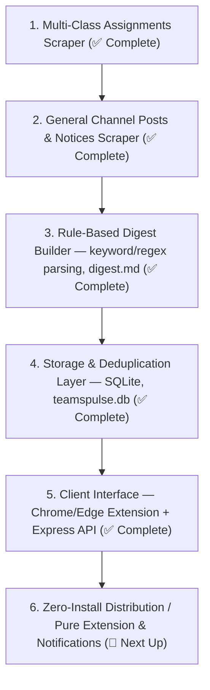

# TeamsPulse — Project Context & Technical Architecture

> **Purpose of this document**: Provide a single source of truth for both developers and AI agents. It documents all proven techniques, selector strategies, dead ends to avoid, current progress, and the exact roadmap.  
> **Agent Directive**: Any AI agent working on this repository **must read this file first** to understand the architecture without re-investigating from scratch, and **must update this file** after implementing new features or discovering new techniques.

---

## 1. Project Overview & Vision

- **Project Name**: TeamsPulse (`teamspulse`)
- **Repository**: `https://github.com/Sa-Alfy/teampulse.git`
- **Core Mission**: Microsoft Teams is bloated, slow, and noisy. Important academic data (Class Test dates, assignment deadlines, teacher announcements, room changes) gets lost in chat threads. TeamsPulse scrapes this data in the background and delivers a clean, unified **Daily Academic Briefing** for university students.
- **Data Target**:
  1. Enrolled Classes / Teams list *(Completed)*
  2. Assignments across Upcoming, Past Due, and Completed tabs *(Completed)*
  3. Channel Posts & Teacher Announcements from `General` channel *(Completed)*
  4. Rule-based Digest Builder — keyword + regex parsing into readable `digest.md` *(Completed)*
  5. Storage & Deduplication Layer (SQLite via `better-sqlite3`, `db.js`, `teamspulse.db`) *(Completed)*
  6. Client Interface (Chrome/Edge Extension & Local Express API Server) *(Completed)*
  7. Zero-Install Distribution & Notification Channels *(Planned)*
- **Planned Frontends**: Lightweight Chrome/Edge Extension (Manifest V3, localhost:3457 Express bridge) and optional 1-click portable desktop bundle / Web Store distribution.

---

## 2. Hard-Won Technical Decisions (Do Not Re-Try Dead Ends!)

### ❌ The Microsoft Graph API Dead End
- **What was attempted**: Azure AD application registration (`MyClassApp`, Client ID `e4845e5c-f8ed-4628-8dc2-4fb577b5419b`, Tenant `d64fc2a1-e3c6-4a8a-8d65-4366182c78f6` - Green University of Bangladesh).
- **Why it failed**:
  - The university tenant enforces a strict blanket policy: **"Users cannot consent to apps"**. Even scopes labeled "Admin consent required: No" (like `User.Read`, `Calendars.Read`) hit an immediate *"Need admin approval"* block screen.
  - Academic scopes (`EduAssignments.Read`, `EduRoster.Read`) require tenant admin approval, which IT departments rarely grant to student developers.
  - The university does **not** sync academic timetables or assignments into Outlook Calendar.
- **Conclusion**: Graph API is unviable for student tools in this tenant.

### ✅ The Playwright Browser Automation Solution
- **Approach**: Automate a real Chromium browser session using the student's own authenticated state.
- **Authentication**: `login-teams.js` launches a visible browser where the student logs in manually and handles university MFA. The session is exported to `auth-teams.json` using `context.storageState()`.
- **Headless Execution**: `teams.js` loads `auth-teams.json` and runs headlessly without requiring login prompts.
- **Security Rule**: `auth-teams.json` is strictly ignored in `.gitignore` and **must never be committed**.

---

## 2.3. Storage & Deduplication Layer (Step 5 — Completed)

### Architecture
- **File**: `db.js` — single-responsibility module, owns all SQLite interaction.
- **Database**: `teamspulse.db` (SQLite, WAL mode) — never committed (listed in `.gitignore`).
- **Dependency**: `better-sqlite3` (synchronous Node.js binding, no async complexity).

### Schema — `posts` table

| Column | Type | Description |
|---|---|---|
| `hash` | TEXT PRIMARY KEY | `sha256(className + "\0" + timestampIso + "\0" + body[:500])` |
| `class_name` | TEXT | Source class (for per-class queries in future steps) |
| `timestamp_iso` | TEXT | ISO 8601 post timestamp (may be null if Teams didn't parse it) |
| `author` | TEXT | Post author |
| `snippet` | TEXT | First 120 chars of body |
| `seen_at` | TEXT | ISO 8601 timestamp of the run that first stored this record |

### Runtime Flow
1. `build-digest.js` calls `db.ensureSchema()` on startup (idempotent).
2. Every post in `notices.json` is hashed; posts already in the DB are skipped.
3. `digest.md` is written with **new posts only**.
4. New posts are then `INSERT OR IGNORE`-ed into `posts` — done after the write so a crash doesn't silently swallow posts.

### Exported API (`db.js`)
```js
db.ensureSchema()              // CREATE TABLE IF NOT EXISTS — safe on every run
db.hashPost(className, post)   // → hex sha256 string
db.isNew(hash)                 // → boolean (true = never seen)
db.markSeen(hash, {className, post})  // INSERT OR IGNORE
db.close()                     // close connection (useful in tests)
db.DB_PATH                     // absolute path to teamspulse.db
```

---

## 2.4. Client Interface & Local API Server (Step 5 — Completed)

### Architecture: Chrome Extension + Local Express API
Because Manifest V3 Chrome extensions cannot access the local filesystem or SQLite directly, a local Express API serves as the read-only bridge:

```
[Chrome Extension popup]
        ↕ fetch("http://localhost:3457/api/...")
[Local Express API server — server.js]
        ↕ better-sqlite3 / JSON reads
[teamspulse.db + notices.json + assignments.json + digest-utils.js]
```

### Components
1. **Shared Parser Utility (`digest-utils.js`)**:
   - Houses deterministic parsing rules: `isNoteworthy()`, `classify()`, `extractDate()`, `extractTime()`, `truncate()`, `escapeCell()`, `shortClassName()`.
   - Shared between `build-digest.js` (CLI) and `server.js` (API) — zero code duplication.
2. **Local Express API Server (`server.js`)**:
   - Fixed port `3457` (binds to `127.0.0.1` only).
   - Strict read-only: never launches Playwright or modifies files.
   - Endpoints:
     - `GET /`: Friendly HTML status dashboard with direct links to all endpoints.
     - `GET /api/ping`: Liveness check `{ "ok": true }`.
     - `GET /api/status`: Returns `totalSeen`, `lastRun`, `lastScrape`, `serverTime`.
     - `GET /api/digest`: Assembles classes with categorized notices & assignments.
     - `GET /api/recent?hours=N`: Queries `posts` table from `teamspulse.db`.
   - CORS enabled for `chrome-extension://*` and `http://localhost`.
3. **Chrome / Edge Extension (`extension/`)**:
   - **`manifest.json`**: Manifest V3, zero background service worker overhead, host permissions scoped to `http://localhost:3457/*`.
   - **`popup.html` / `popup.css` / `popup.js`**:
     - **380px** modern dark-theme dashboard (inspired by Linear / Teams dark mode).
     - **Class-Based Categorization**: Notices and assignments grouped per enrolled class (`CSE 312`, `PHY 104`, etc.).
     - **Category Switcher Tabs**: `All (N)` · `📢 Notices (N)` · `📝 Tasks (N)`.
     - **Filters**: Class filter dropdown, Time filter (`All Time` default, `24h`, `48h`, `7d`).
     - **Instant Search**: Real-time filtering across class names, tags, summaries, authors, and task titles.
     - **Live Sync**: Auto-polls every 15s with an animated `● Live` status badge and last sync ticker.
   - **`icons/`**: Native PNG icons (`icon16.png`, `icon48.png`, `icon128.png`).

---

## 3. Proven DOM Selectors & Scraper Techniques

### 3.1. Avoid Fluent UI Atomic Class Names
- **Rule**: Teams v2 uses Fluent UI with generated atomic class hashes (e.g. `f22iagw`, `rfxo2k2`, `___11yg1ik`). These change across builds. **Never use them as selectors.**
- **Safe Anchors**: Use `data-testid`, `data-test`, structural container IDs (`#classroom`), ARIA roles (`[role="treeitem"]`), or semantic BEM-like class fragments (`.fui-CardHeader__header`).

### 3.2. Teams List
- Target: `page.locator('[data-testid="team-name"]')`
- Extracts all enrolled class names on `https://teams.microsoft.com/v2/`.

### 3.3. Class Navigation & The "Assignments" Post Trap
- **The Bug**: Using `page.getByText("Assignments").last()` failed on classes that had active chat posts because bot notifications inside the channel feed contain the text `"Assignments"`, hijacking the click!
- **The Fix**: Target the class-level sidebar navigation specifically:
  ```javascript
  let assignmentsBtn = page.locator('#classroom, [role="treeitem"]').getByText("Assignments", { exact: true }).first();
  if ((await assignmentsBtn.count()) === 0) {
    assignmentsBtn = page.locator('a[role="treeitem"]').filter({ hasText: "Assignments" }).first();
  }
  ```

### 3.4. Assignments Iframe Piercing
- The Assignments app is hosted in an isolated cross-origin iframe:
  `iframe[src*="assignments.edu.cloud.microsoft"]`
- Use Playwright's `page.frameLocator(...)` to query inside it.
- **Tab Buttons**: `[data-test="Upcoming"]`, `[data-test="Past due"]`, `[data-test="Completed"]`.
  - *Note*: Fluent UI creates duplicate hidden elements for sizing; **always use `.first()`**.
- **Cards**: `[data-test="assignment-card"]`
  - Title: `.fui-CardHeader__header`
  - Due Details: `.fui-CardHeader__description`
  - Status Pill: `.fui-CardHeader__action`
  - Card ID attribute contains a stable GUID (ideal for database deduplication).

### 3.5. Empty Class State Tolerance (The CSE 304 Fix)
- Classes with 0 assignments never render the "Upcoming" / "Past due" / "Completed" tabs; they display `"No assignments in this class yet"`.
- Waiting only for tab selectors causes a 15–20s timeout failure.
- **The Fix**: Use `Promise.race`:
  ```javascript
  await Promise.race([
    frameLocator.locator('[data-test="Completed"], [data-test="assignment-card"], [data-test="Upcoming"], [data-test="Past due"]').first().waitFor({ timeout: 20000 }),
    frameLocator.getByText("No assignments in this class yet", { exact: false }).first().waitFor({ timeout: 20000 }),
  ]);
  ```
### 3.6. In-App Back Navigation
- Full page reloads (`page.goto(TEAMS_URL)`) between classes are slow (15–30s) and flaky.
- **The Fix**: Click the in-app `page.getByText("All teams").first()` button to return to the grid, with a fallback to full reload only if navigation times out.

### 3.7. Channel Posts & Notices Selectors (Teams v2 Virtual Feed)
- **Lazy Hydration Timing**: Teams v2 renders channel messages inside a virtual scroll runway (`[data-tid="channel-pane-runway"]`). Elements take 5–10 seconds to hydrate from the background sync service. Always poll for `[data-tid="channel-pane-message"]` (up to 12s) rather than relying on an immediate `waitForSelector({ state: 'visible' })`.
- **Message Container**: `[data-tid="channel-pane-message"]`
- **Subheader & Author**:
  - Regular users: `[data-tid="post-message-subheader"]` contains the author's name followed by the timestamp and optional `"Edited"`. Strip the timestamp and `"Edited"` to extract the clean author name.
  - Bots / System Cards: `[data-tid="app-profile-card-trigger"]` is present instead of human avatar for bot notifications (e.g. Assignments bot).
- **Timestamp & ISO Date Parsing**:
  - Element: `[data-tid="timestamp"]`
  - Visible text: e.g. `"8/29 5:20 PM"`.
  - Full attribute: `getAttribute('title')` or `getAttribute('aria-label')` contains the full string: `"Saturday, August 29, 2026 5:20 PM"`.
  - Parseable directly via `Date.parse(timestampFull)` into an exact ISO timestamp (`timestampIso`), enabling 24–48 hour filtering.
- **Subject Line**: `[data-tid="subject-line"]` (present on titled announcements).
- **Announcement Banner**: `[data-tid="team-badge"]` identifies official highlighted announcements with red indicator bars.
- **Attachments & URLs**:
  - File cards: `[data-tid="file-attachment-grid"] [role="gridcell"], [data-tid="file-name"]`.
  - Link previews: `[data-tid="url-preview"]`.
- **Replies**:
  - Container: `[data-tid="response-surface"]`.
  - Header: `[data-tid="reply-message-header"]`.
  - Body: `[data-tid="message-body"]`.
- **Channel Tag Leak Trap**: Teams often appends the channel or class name with non-breaking spaces (`\u00a0`) to the message footer. Normalize `[\u00a0\s]+` regex before stripping `className` from the body.

---

## 4. Current Project State & Verification

- **Classes Scraped**: 6 out of 6 classes verified end-to-end on live session.
- **Assignments Extracted** (`assignments.json`):
  - `CSE 303`: 3 Completed
  - `PHY 104`: 0 (clean empty read)
  - `CSE 311`: 2 Completed
  - `CSE 312`: 7 Past due, 2 Completed
  - `MAT 103`: 1 Past due
  - `CSE 304`: 0 (detected empty state instantly)
- **Channel Notices Extracted** (`notices.json`):
  - `CSE 303`: 0 (clean empty channel read)
  - `PHY 104`: 4 posts (class reschedule notices, lab announcements, WhatsApp form)
  - `CSE 311`: 4 posts (extra classes, Zoom links, presentation notices)
  - `CSE 312`: 4 posts (hardware session, lab final, 60% marks announcement)
  - `MAT 103`: 4 posts (online class links, presentation group sheets)
  - `CSE 304`: 4 posts (project final links, 70% marks updated announcement)
- **Digest Built** (`digest.md`): Human-readable table per course combining notices + assignments. Generated by `build-digest.js`, zero API calls.
- **Outputs**: Clean JSON saved to `assignments.json` and `notices.json`. Readable digest in `digest.md`.
- **Executables**:
  - `npm run scrape` (`teams.js`): Unified single-pass scraper for both assignments & notices.
  - `npm run scrape:posts` (`scrape-posts.js`): Dedicated channel notices & announcements scraper with 24–48h filtering support.
  - `node build-digest.js`: Rule-based digest builder — reads `notices.json` + `assignments.json`, outputs `digest.md`.

---

## 5. Active Roadmap & Future Architecture



### Step 5: Client Interface (Chrome Extension) — Design Decision Log
- **Architecture**: Chrome Extension (Manifest V3) + Local Express API (`server.js` on port `3457`).
- **Data Flow**: `notices.json` & `assignments.json` & `teamspulse.db` -> `server.js` -> Extension popup.
- **Categorization**: Grouped by class (`CSE 312`, `PHY 104`, etc.) with subheadings for Notices and Tasks.
- **Tabs**: `All`, `📢 Notices`, `📝 Tasks` with dynamic count badges.
- **Time Filter**: Defaults to "All Time" to prevent semester-wide notices from being hidden, with options for 24h, 48h, 7d.
- **Real-time**: Live polling every 15s with `● Live` status badge and last sync ticker.
- **Instant Search**: Live client-side keyword search across classes, tags, and assignments.

### Immediate Next Step: Zero-Install Distribution (Step 6)
- Solve the friction barrier for non-technical students:
  1. **Pure Chrome Web Store Extension**: Read directly from `teams.microsoft.com` tab in-browser, bypassing local Node.js / server altogether.
  2. **1-Click Portable Bundle**: Double-click `.bat` launcher with portable embedded Node.js for zero-install friend sharing.
  3. **Push Notifications**: Telegram bot or native desktop notifications for morning briefings.

---

## 6. Guidelines for Future AI Agents
1. **Always read this file first** before touching code.
2. **Never guess selectors**: Run small diagnostic inspection scripts and view screenshots before modifying scrapers.
3. **Never commit sensitive files**: Double-check `git status` to ensure `auth-teams.json`, `assignments.json`, and debug screenshots are never staged.
4. **Update this document**: Whenever you solve a new selector problem, add a feature, or complete a roadmap milestone, document it here immediately.

