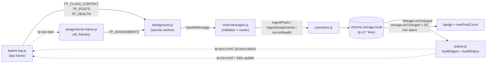
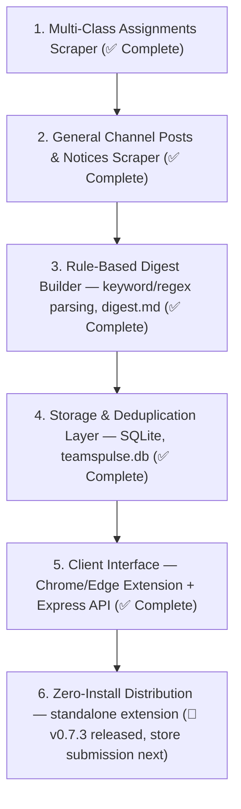

# TeamsPulse — Project Context & Technical Architecture

> **Purpose of this document**: Provide a single source of truth for both developers and AI agents. It documents all proven techniques, selector strategies, dead ends to avoid, current progress, and the exact roadmap.  
> **Agent Directive**: Any AI agent working on this repository **must read this file first** to understand the architecture without re-investigating from scratch, and **must update this file** after implementing new features or discovering new techniques.

---

## 1. Project Overview & Vision

- **Project Name**: TeamsPulse (`teamspulse`)
- **Repository**: `https://github.com/Sa-Alfy/teampulse.git`
- **Core Mission**: Microsoft Teams is bloated, slow, and noisy. Important academic data (Class Test dates, assignment deadlines, teacher announcements, room changes) gets lost in chat threads. TeamsPulse scrapes this data in the background and delivers a clean, unified **Daily Academic Briefing** for university students.
- **Data Target**:
  1. Enrolled Classes / Teams list *(Completed)*
  2. Assignments across Upcoming, Past Due, and Completed tabs *(Completed)*
  3. Channel Posts & Teacher Announcements from `General` channel *(Completed)*
  4. Rule-based Digest Builder — keyword + regex parsing into readable `digest.md` *(Completed)*
  5. Storage & Deduplication Layer (SQLite via built-in `node:sqlite`, `db.js`, `teamspulse.db`) *(Completed)*
  6. Client Interface (Chrome/Edge Extension & Local Express API Server) *(Completed)*
  7. Zero-Install Distribution & Notification Channels *(Planned)*
- **Frontends**: Standalone Chrome/Edge extension (Manifest V3, `chrome.storage.local`, no server — v0.6.0) and the optional self-host pipeline (Playwright + `digest.md` + Telegram + local JSON API on `127.0.0.1:3457`).

---

## 2. Hard-Won Technical Decisions (Do Not Re-Try Dead Ends!)

### ❌ The Microsoft Graph API Dead End
- **What was attempted**: Azure AD application registration (`MyClassApp`) against the
  university tenant. (Client ID and tenant ID intentionally omitted - they identify the
  author's institution and app registration, and this file is public.)
- **Why it failed**:
  - The university tenant enforces a strict blanket policy: **"Users cannot consent to apps"**. Even scopes labeled "Admin consent required: No" (like `User.Read`, `Calendars.Read`) hit an immediate *"Need admin approval"* block screen.
  - Academic scopes (`EduAssignments.Read`, `EduRoster.Read`) require tenant admin approval, which IT departments rarely grant to student developers.
  - The university does **not** sync academic timetables or assignments into Outlook Calendar.
- **Conclusion**: Graph API is unviable for student tools in this tenant.

### ✅ The Playwright Browser Automation Solution
- **Approach**: Automate a real Chromium browser session using the student's own authenticated state.
- **Authentication**: `login-teams.js` launches a visible browser where the student logs in manually and handles university MFA. The session is exported to `auth-teams.json` using `context.storageState()`.
- **Headless Execution**: `teams.js` loads `auth-teams.json` and runs headlessly without requiring login prompts.
- **Security Rule**: `auth-teams.json` is strictly ignored in `.gitignore` and **must never be committed**.

---

## 2.3. Storage & Deduplication Layer (Step 5 — Completed)

### Architecture
- **File**: `db.js` — single-responsibility module, owns all SQLite interaction.
- **Database**: `teamspulse.db` (SQLite, WAL mode) — never committed (listed in `.gitignore`).
- **Dependency**: none - uses Node's built-in `node:sqlite` (`DatabaseSync`).
  Requires **Node 24+** (the module does not exist before 22.5 and warns on 22.x).
  `better-sqlite3` is NOT used and is not in `package.json`.
- **Fingerprint source of truth**: `extension/core/fingerprint.js` → `fingerprintString()`.
  `db.js` imports this function and feeds the result into `crypto.createHash("sha256")`.
  The async `hashPost` in `fingerprint.js` uses SubtleCrypto and produces identical hex.

### Schema — `posts` table

| Column | Type | Description |
|---|---|---|
| `hash` | TEXT PRIMARY KEY | `sha256(rawClassName \0 author \0 timestampIso \0 subject \0 body[:500])` — **five** fields, null-byte separated. Subject and author are included because two posts in one class at one minute with the same body but different subjects are two posts. Versioned via `PRAGMA user_version`. |
| `class_name` | TEXT | **Raw** class name - never the shortened display label |
| `surfaced` | INTEGER | 1 = appeared in a digest (suppresses future runs); 0 = scraped but filtered out as not noteworthy. Only surfaced posts count as seen, so loosening the classifier can still surface the rest. |
| `timestamp_iso` | TEXT | ISO 8601 post timestamp (may be null if Teams didn't parse it) |
| `author` | TEXT | Post author |
| `snippet` | TEXT | First 120 chars of body |
| `seen_at` | TEXT | ISO 8601 timestamp of the run that first stored this record |

### Runtime Flow
1. `build-digest.js` calls `db.ensureSchema()` on startup (idempotent).
2. Every post in `notices.json` is hashed; posts already in the DB are skipped.
3. `digest.md` is written with **new posts only**.
4. New posts are then `INSERT OR IGNORE`-ed into `posts` — done after the write so a crash doesn't silently swallow posts.

### Exported API (`db.js`)
```js
db.ensureSchema()              // CREATE TABLE IF NOT EXISTS — safe on every run
db.hashPost(className, post)   // → hex sha256 string (delegates to fingerprintString)
db.isNew(hash)                 // → boolean (true = never seen)
db.markSeen(hash, {className, post})  // INSERT OR IGNORE
db.close()                     // close connection (useful in tests)
db.DB_PATH                     // absolute path to teamspulse.db
```

---

## 2.4. Client Interface & Local API Server (Step 5 — Completed)

### Architecture: Local Express API (self-host)
Historically (≤ v0.5.0) the extension popup read this API over `localhost:3457`. Since v0.6.0 the extension is standalone (§2.5); the API remains for the self-host pipeline:

```
[any local client]
        ↕ HTTP GET 127.0.0.1:3457/api/...
[Local Express API server — server.js]
        ↕ node:sqlite / JSON reads
[teamspulse.db + notices.json + assignments.json + digest-utils.js]
```

### Components
1. **Shared Parser Utility (`digest-utils.js`)**:
   - Houses deterministic parsing rules: `isNoteworthy()`, `classify()`, `extractDate()`, `extractTime()`, `truncate()`, `escapeCell()`, `shortClassName()`.
   - Shared between `build-digest.js` (CLI) and `server.js` (API) — zero code duplication.
2. **Local Express API Server (`server.js`)**:
   - Fixed port `3457` (binds to `127.0.0.1` only).
   - Strict read-only: never launches Playwright or modifies files.
   - Endpoints:
     - `GET /`: Friendly HTML status dashboard with direct links to all endpoints.
     - `GET /api/ping`: Liveness check `{ "ok": true }`.
     - `GET /api/status`: Returns `totalSeen`, `lastRun`, `lastScrape`, `serverTime`.
     - `GET /api/digest`: Assembles classes with categorized notices & assignments.
     - `GET /api/recent?hours=N`: Queries `posts` table from `teamspulse.db`.
   - CORS enabled for `chrome-extension://*` and `http://localhost`.
3. **Browser extension (`extension/`)**: since v0.6.0 the extension **no longer reads this API** — it is standalone (see §2.5). `server.js` remains the JSON API for the self-host pipeline. The 15 s localhost polling was replaced by `chrome.storage.onChanged`. The popup was redesigned in v0.7.0 (Overview / Tasks / Updates; see §2.5 "Popup"). The old class-card UI with collapse state, time filter and dropdowns is gone.
   - **`icons/`**: PNG icons `icon16/32/48/128.png` (v0.7.3 pulse logo). The source is `assets/logo.svg` (48/128) and `assets/logo-small.svg` (heavier line for 16/32). Regenerate with `npm run build:icons` (`scripts/build-icons.js`, which renders through the project's Playwright Chromium, so no new dependency).

---

## 2.5. Standalone Extension Architecture (since v0.6.0; current release v0.7.3)

### Goal
No Node.js / Express server for end users. Content scripts read the Teams pages the student already has open; data lives in `chrome.storage.local`; the popup and badge are computed in the browser. The extension makes **no network requests** (CSP `connect-src 'none'`; no `fetch`/XHR/WebSocket/`eval` in `extension/`).

### Data Flow


```mermaid
flowchart LR
    CS1["teams-top.js\n(top frame)"] -->|TP_CLASS_CONTEXT\nTP_POSTS\nTP_HEALTH| SW["background.js\n(service worker)"]
    CS2["assignments-frame.js\n(all_frames)"] -->|TP_ASSIGNMENTS| SW
    SW -->|handleMessage| MSG["core/messages.js\n(validator + router)"]
    MSG -->|ingestPosts / ingestAssignments / recordHealth| STORE["core/store.js"]
    STORE --> CHROME[(chrome.storage.local\ntp:v1:* keys)]
    CHROME -->|storage.onChanged| POP["popup.js\nbuildDigest + buildStatus"]
    CHROME -->|storage.onChanged + 30-min alarm| BADGE["badge = newPostCount"]
    POP -.->|tp:sync:cmd / tp:sync:status| CS1
    POP -.->|tp:nav:cmd + tabs.update| CS1
    CS1 -.->|tp:nav:task| CS2
```

### Manifest (verbatim intent)
- `permissions`: `["alarms", "storage", "unlimitedStorage"]` — no `host_permissions`, no `tabs`, no `scripting`.
- `content_security_policy.extension_pages`: `script-src 'self'; object-src 'self'; img-src 'self' data:; connect-src 'none'; base-uri 'none'; form-action 'none'`.
- Content-script matches: `https://teams.microsoft.com/*`, `https://teams.cloud.microsoft/*` (seen live 2026-10-01), `https://assignments.edu.cloud.microsoft/*` (iframe).
- `icons` (top level, added v0.7.3) and `action.default_icon`: 16/32/48/128. Without the top-level key, `chrome://extensions` showed a generic icon.
- The popup calls `chrome.tabs.update` / `chrome.tabs.create` / `chrome.windows.update` (Open in Teams). These need **no** `tabs` permission, which only gates reading url/title. This is proven by the e2e test with the shipped manifest.

### Component Breakdown

| File | Role |
|------|------|
| `extension/core/digest-utils.js` | Parsing rules shared with Node (the root `digest-utils.js` just re-exports this file, so changes also affect the self-host digest): `isNoteworthy`, `classify`, `extractDate`, `extractTime`, …. `extractDate` reads ISO `YYYY-MM-DD` / `YYYY/MM/DD` first (19xx/20xx only, v0.7.0), then `DD.MM.YYYY`, then scans every word-date match; the earliest real date wins. |
| `extension/core/fingerprint.js` | `fingerprintString`, async `sha256Hex` (SubtleCrypto) — identical hashes to `db.js`. |
| `extension/core/store.js` | `createStore(backend)`: promise-queued writes, 200-post cap, filter-first/dedup-second, `recordHealth`, `clearAll` (all `tp:v1:*`). |
| `extension/core/shape.js` | `buildDigest`, `buildStatus` (same shapes as `server.js`) + `scraper` / `scraperIssues` (extension only). |
| `extension/core/messages.js` | `handleMessage`: origin allowlist, size limits, tab-context join via `chrome.storage.session`, `TP_HEALTH` status allowlist. |
| `extension/content/teams-top.js` | Class name, posts, health reports, Sync all classes, auto-sync (at most every 6 h, `tp:settings:autoSync`), re-send after Clear, orphan shutdown, **Open in Teams** (`runNav` / `navigateToPost` / `navigateToTask`, v0.7.1). |
| `extension/content/assignments-frame.js` | 3-tab loop → `TP_ASSIGNMENTS` plus a capture report (`tp:v1:capture-report`). Retries twice (3 s) while the class context is missing. Jumps to an assignment card (`maybeNav` / `navToCard`, v0.7.1); a pending jump runs **before** a capture (v0.7.2). |
| `extension/background.js` | `importScripts` core, message router, `tabs.onRemoved` cleanup, badge = new-post count (install, startup, storage change, 30-min alarm). Clears the legacy `teamspulse-badge-poll` alarm. |
| `extension/popup.js` | Reads the store; live-updates on `storage.onChanged`. Overview / Tasks / Updates views, class chips, search, done/read marks, Open in Teams, `.ics` export, capture details (shown only on a problem), no-data / stale / scraper banners, Clear stored data (two-click confirm), Sync. Scraped text goes only through `textContent`; `https:` links are the only `<a>` elements. |

### Class detection (Implemented: `getCurrentClassName()` in `teams-top.js`)
Confirmed with `tools/dom-probe.js` on `teams.cloud.microsoft`: `document.title` is `Teams and Channels | <team name> | <channel> | Microsoft Teams` and the channel heading is `h2[data-tid="channelTitle-text"]`. The team name is the title segment immediately before the segment equal to the heading. If the two signals disagree → `null` → nothing sent (and a `no-class` health report after 10 s). The team name matched the `[data-testid="team-name"]` text exactly in live screenshots, so extension and self-host keys line up.

### Sync all classes (Implemented: `syncAllClasses()` in `teams-top.js`)
Selectors from `tools/dom-probe-teams-list.js`: grid `[data-tid="teams-grid-view"]`, classes `[data-tid="ClassTeamsSection-panel"] button[data-testid="team-name"]` (Hidden section excluded), app-bar Teams button `button[data-tid="2a84919f-59d8-4441-a975-2a8c2643b741"]`. Back navigation clicks the control whose text is exactly "All teams" (seen on screen; **not probed**), falling back to the app-bar button. The popup cannot message tabs without `tabs`, so it writes `tp:sync:cmd`; only the **visible** Teams tab runs it and reports `tp:sync:status`.

### Scraper health (Implemented)
`teams-top.js` reports once per onset: `no-class` (channel view on screen, class unresolved for 10 s) and `no-messages` (class resolved, zero messages for 60 s). `buildStatus` marks the scraper `suspect` while a report is newer than the relevant last successful capture; the popup shows "Scraper may be out of date. Check for an extension update."

### Popup (Implemented v0.7.0: `popup.js`)
Organised around "what do I need to do, and by when", not by class.
- **Overview** (`renderOverview`, the default): a one-line summary ("2 overdue · 1 today") plus the next item. Then `bucketize()` groups: Overdue → Today → Tomorrow → This week → Later → No due date. Overdue items older than 14 days (`OLD_OVERDUE_DAYS`) fold behind "Show N older". Below that, up to 5 unread announcements not already on the agenda.
- **Agenda events** (`buildModel`): announcements tagged CT/Quiz, Exam, Presentation, Reschedule, Cancelled or Deadline (`EVENT_TAGS`) with a date today or later. They are deduplicated per class/day/tag (newest post kept) and dropped when an assignment due that day has its title in the post.
- **Tasks** (`renderTasks`): open assignments in the same buckets. "Mark done" goes to `tp:ui:done` and only hides the task in TeamsPulse.
- **Updates** (`renderUpdates`): announcements newest first, grouped Today / Yesterday / This week / Earlier. "New" means `isNew` (24 h capture window) and not in `tp:ui:read`; there is also "Mark all as read".
- Tab counts show "things that need you": attention items, open tasks, unread updates. `#countAssignments` = open (not done) tasks; the e2e test asserts it.
- Class chips (stable colour per raw class key via `classColor`) filter all tabs. Search lives behind 🔍, Auto-sync behind ⚙, and `.ics` export under the list. The popup is fixed at 380×600 and only `<main>` scrolls.
- Links (`appendLinkified`): only `https:` URLs that parse become `<a target=_blank rel="noopener noreferrer">` (owner-approved 2026-10-03). Long ones show as "🔗 host/…"; other schemes stay text.
- Done/read keys are built from raw class + title/due date or timestamp/subject (`taskKey` / `noticeKey`). `pruneUiSets` drops keys whose item is gone, and Clear stored data removes them.

### Open in Teams (Implemented v0.7.1, fixed v0.7.2: popup → `teams-top.js` → `assignments-frame.js`)
- **Popup** (`openInTeams`): stores `tp:nav:cmd` `{ kind, id, at, className, … }` **first**, because switching tabs closes the popup. It then activates a Teams tab known from the background's `tp:tabctx:<tabId>` session notes (a tab showing that class is preferred) and focuses its window. If none is known, it opens `https://teams.cloud.microsoft/` in a new tab. Then `window.close()`.
- **Top frame** (`runNav`): commands older than 2 min (`NAV_MAX_AGE_MS`) are ignored. Only a **visible** tab acts; a hidden tab keeps the command until `visibilitychange`, and a freshly opened tab reads it on load. Commands are refused while syncing.
  - `post`: `openClass()` (same grid + class-button navigation as Sync). Then `findPostIndex()` matches with the capture's own `extractPosts()`: `timestampIso` + (subject equal or body starts with the first 40 chars), falling back to text only. If not found, up to 8 rounds of scrolling the first message into view load older posts. On a hit it scrolls to the post and outlines it for 3.5 s. Misses show a text-only toast on the Teams page.
  - `task`: forwards `tp:nav:task` and clicks the Assignments app button. The frame never reads `tp:nav:cmd` directly, so a click made during a sync can't move the list mid-capture.
- **Frame** (`maybeNav` → `navToCard`): selects the item's tab (Upcoming / Past due), then finds the card by GUID (`assignmentId`), else by title (+ class short name in the all-classes view). It walks a virtualized list until the card renders, scrolls to it and outlines it. **The card is not clicked**: opening it navigates the frame, which would start a capture of a page with no list. A pending jump defers `requestScrape` (v0.7.2) so it isn't stuck behind a minute-long capture.
- **Live (owner, 2026-10-03, v0.7.2):** posts (including older ones found by scrolling up) and assignment cards both open correctly.

### Local storage keys (besides `tp:v1:*` data from `store.js`)
| Key | Area | Owner | Purpose |
|---|---|---|---|
| `tp:tabctx:<tabId>` | session | background (`messages.js`) | class open in each Teams tab; also how the popup finds Teams tabs |
| `tp:sync:cmd` / `tp:sync:status` / `tp:sync:lastAuto` | local | popup ↔ `teams-top.js` | Sync all classes command, progress, last auto-sync |
| `tp:settings:autoSync` | local | popup | Auto-sync toggle (default on) |
| `tp:nav:cmd` / `tp:nav:task` | local | popup → top → frame | Open in Teams |
| `tp:ui:done` / `tp:ui:read` | local | popup | tasks marked done / announcements read (cleared by Clear stored data) |

### Important constraints
- **Content scripts must not import from `core/`** — IIFE-wrapped and self-contained.
- **`importScripts` shares one global scope**: top-level `const`/`let` names in `background.js` and `core/*.js` must be unique (`test/background-load.test.js` enforces it).
- **After an extension reload/update, already-open Teams tabs are orphaned** (Chrome doesn't re-inject). The script stops cleanly; the user must reload the Teams tab. Auto re-injection would need `scripting` + host permissions — **not added** (owner decision pending).
- **Never add permissions, host matches, network calls or remote code without the owner's approval** (see `CLAUDE.md`).

### Verification status (updated 2026-10-03)
- **Verified live**: post capture and class detection on `teams.cloud.microsoft` (2 classes, one account); service worker registration after the `_store` fix.
- **Verified live by the owner (2026-10-01)**: Sync all classes, including returning to the classes grid between classes (which back control fired — "All teams" text or the app-bar fallback — was not observed).
- **Verified live by the owner (2026-10-03, one student account, v0.7.2)**: Sync captures assignments without stalling on the empty Upcoming tab. Open in Teams works for assignment cards and for announcements, including older posts found by scrolling up. The v0.7.0 popup is in daily use.
- **Not verified live**: health warnings, .ics import into calendar apps, other locales/layouts (empty-state and label matching is English-only), multiple Teams tabs, a class open on a non-General channel when opening a post.
- **Verified against mocks**: server parity (`test/server-parity.test.js`), real unpacked extension end-to-end (`test-dom/extension-e2e.js`).

### Release & packaging (Implemented)
- `npm run pack:extension` (`scripts/pack-extension.js`): zip of runtime files only, built with Node `zlib` (no deps); fails if a file referenced by the manifest, background `importScripts` or popup is missing. Output `dist/teamspulse-extension-<version>.zip` (`dist/` is git-ignored).
- `PRIVACY.md` (store privacy policy) and `docs/store-listing.md` (descriptions, permission justifications, data-usage answers, open decisions).
- GitHub releases, each with its zip: v0.6.0–v0.7.1 are pre-releases. **v0.7.2** was promoted to a full release after the owner confirmed it live. **v0.7.3** (logo) is the current **Latest**: https://github.com/Sa-Alfy/teampulse/releases/tag/v0.7.3
- To release: bump `extension/manifest.json` `version` and update the CHANGELOG heading, the README status line and the `PRIVACY.md` "applies to" version. Commit, push `main`, run `npm run pack:extension`, then `gh release create vX.Y.Z dist/teamspulse-extension-X.Y.Z.zip --target main [--prerelease]`. Use `--prerelease` until the owner confirms the change on live Teams; promote with `gh release edit vX.Y.Z --prerelease=false --latest`. `package.json` `version` (0.5.0) is not used for releases.
- Repo-local git identity is set for this checkout (`git config user.name/user.email`, owner's choice 2026-10-03). Never push without the owner asking.
- **Open owner decisions**: product name (trademark), store data-usage wording, privacy-policy URL, auto re-injection after updates (needs `scripting` + host permissions).

---


### 3.1. Avoid Fluent UI Atomic Class Names
- **Rule**: Teams v2 uses Fluent UI with generated atomic class hashes (e.g. `f22iagw`, `rfxo2k2`, `___11yg1ik`). These change across builds. **Never use them as selectors.**
- **Safe Anchors**: Use `data-testid`, `data-test`, structural container IDs (`#classroom`), ARIA roles (`[role="treeitem"]`), or semantic BEM-like class fragments (`.fui-CardHeader__header`).

### 3.2. Teams List
- Target: `page.locator('[data-testid="team-name"]')`
- Extracts all enrolled class names on `https://teams.microsoft.com/v2/`.

### 3.3. Class Navigation & The "Assignments" Post Trap
- **The Bug**: Using `page.getByText("Assignments").last()` failed on classes that had active chat posts because bot notifications inside the channel feed contain the text `"Assignments"`, hijacking the click!
- **The Fix**: Target the class-level sidebar navigation specifically:
  ```javascript
  let assignmentsBtn = page.locator('#classroom, [role="treeitem"]').getByText("Assignments", { exact: true }).first();
  if ((await assignmentsBtn.count()) === 0) {
    assignmentsBtn = page.locator('a[role="treeitem"]').filter({ hasText: "Assignments" }).first();
  }
  ```

### 3.4. Assignments Iframe Piercing
- The Assignments app is hosted in an isolated cross-origin iframe:
  `iframe[src*="assignments.edu.cloud.microsoft"]`
- Use Playwright's `page.frameLocator(...)` to query inside it.
- **Tab Buttons**: `[data-test="Upcoming"]`, `[data-test="Past due"]`, `[data-test="Completed"]`.
  - *Note*: Fluent UI creates duplicate hidden elements for sizing; **always use `.first()`**.
- **Cards**: `[data-test="assignment-card"]`
  - Title: `.fui-CardHeader__header`
  - Due Details: `.fui-CardHeader__description`
  - Status Pill: `.fui-CardHeader__action`
  - Card ID attribute contains a stable GUID. **Implemented**: `teams.js` reads it into
    `assignmentId` (see `extractGuid`), alongside a `dueDate` parsed from the card's
    `datetime`/`title` attribute or its description text.
- **Empty-state wording (live, 2026-10-03)**: the class view says "No assignments"; the left-bar
  all-classes view says **"No upcoming assignments right now."** (with "Try navigating to the
  individual class team…"). Before v0.7.2, `EMPTY_RE` only knew the first wording, so an empty Upcoming
  waited the full 20 s and the capture came back partial. **Implemented**
  (`assignments-frame.js` `EMPTY_RE`): `/^\s*no\s+(?:[a-z'-]+\s+){0,3}assignments\b/i`, matched against
  a whole text node so a card title like "no late assignments accepted" doesn't count. Unknown wording
  ("You're all caught up") still times out and is reported, which is the matrix test "other empty wording".

### 3.5. Empty Class State Tolerance (The CSE 304 Fix)
- Classes with 0 assignments never render the "Upcoming" / "Past due" / "Completed" tabs; they display `"No assignments in this class yet"`.
- Waiting only for tab selectors causes a 15–20s timeout failure.
- **The Fix**: Use `Promise.race`:
  ```javascript
  await Promise.race([
    frameLocator.locator('[data-test="Completed"], [data-test="assignment-card"], [data-test="Upcoming"], [data-test="Past due"]').first().waitFor({ timeout: 20000 }),
    frameLocator.getByText("No assignments in this class yet", { exact: false }).first().waitFor({ timeout: 20000 }),
  ]);
  ```
### 3.6. In-App Back Navigation
- Full page reloads (`page.goto(TEAMS_URL)`) between classes are slow (15–30s) and flaky.
- **The Fix**: Click the in-app `page.getByText("All teams").first()` button to return to the grid, with a fallback to full reload only if navigation times out.

### 3.7. Channel Posts & Notices Selectors (Teams v2 Virtual Feed)
- **Lazy Hydration Timing**: Teams v2 renders channel messages inside a virtual scroll runway (`[data-tid="channel-pane-runway"]`). Elements take 5–10 seconds to hydrate from the background sync service. Always poll for `[data-tid="channel-pane-message"]` (up to 12s) rather than relying on an immediate `waitForSelector({ state: 'visible' })`.
- **Message Container**: `[data-tid="channel-pane-message"]`
- **Subheader & Author**:
  - Regular users: `[data-tid="post-message-subheader"]` contains the author's name followed by the timestamp and optional `"Edited"`. Strip the timestamp and `"Edited"` to extract the clean author name.
  - Bots / System Cards: `[data-tid="app-profile-card-trigger"]` is present instead of human avatar for bot notifications (e.g. Assignments bot).
- **Timestamp & ISO Date Parsing**:
  - Element: `[data-tid="timestamp"]`
  - Visible text: e.g. `"8/29 5:20 PM"`.
  - Full attribute: `getAttribute('title')` or `getAttribute('aria-label')` contains the full string: `"Saturday, August 29, 2026 5:20 PM"`.
  - Parseable directly via `Date.parse(timestampFull)` into an exact ISO timestamp (`timestampIso`), enabling 24–48 hour filtering.
- **Subject Line**: `[data-tid="subject-line"]` (present on titled announcements).
- **Announcement Banner**: `[data-tid="team-badge"]` identifies official highlighted announcements with red indicator bars.
- **Attachments & URLs**:
  - File cards: `[data-tid="file-attachment-grid"] [role="gridcell"], [data-tid="file-name"]`.
  - Link previews: `[data-tid="url-preview"]`.
- **Replies**:
  - Container: `[data-tid="response-surface"]`.
  - Header: `[data-tid="reply-message-header"]`.
  - Body: `[data-tid="message-body"]`.
- **Channel Tag Leak Trap**: Teams often appends the channel or class name with non-breaking spaces (`\u00a0`) to the message footer.
  **Implemented** in `scrape-posts.js` (`extractPosts`): whitespace is normalised with `[\u00a0\s]+` FIRST,
  then only a **trailing** occurrence is stripped with an anchored regex. A global `split().join("")` also
  deletes the course code out of the middle of legitimate sentences ("CSE 312 lab will be held...").

---

## 4. Current Project State & Verification

- **Classes Scraped**: 6 out of 6 classes verified end-to-end on live session.
- **Assignments Extracted** (`assignments.json`):
  - `CSE 303`: 3 Completed
  - `PHY 104`: 0 (clean empty read)
  - `CSE 311`: 2 Completed
  - `CSE 312`: 7 Past due, 2 Completed
  - `MAT 103`: 1 Past due
  - `CSE 304`: 0 (detected empty state instantly)
- **Channel Notices Extracted** (`notices.json`) - NOTE: the uniform "4 posts" below was a
  hydration ceiling, not a real count. Teams' virtual scroller only renders what is in the
  runway. `scrape-posts.js` now scrolls back (`--scrollback`, default 5 passes), so these
  numbers should be re-measured.

  - `CSE 303`: 0 (clean empty channel read)
  - `PHY 104`: 4 posts (class reschedule notices, lab announcements, WhatsApp form)
  - `CSE 311`: 4 posts (extra classes, Zoom links, presentation notices)
  - `CSE 312`: 4 posts (hardware session, lab final, 60% marks announcement)
  - `MAT 103`: 4 posts (online class links, presentation group sheets)
  - `CSE 304`: 4 posts (project final links, 70% marks updated announcement)
- **Digest Built** (`digest.md`): Human-readable table per course combining notices + assignments. Generated by `build-digest.js`, zero API calls.
- **Outputs**: Clean JSON saved to `assignments.json` and `notices.json`. Readable digest in `digest.md`.
- **Executables**:
  - `npm run scrape` (`teams.js`): Unified single-pass scraper for both assignments & notices.
  - `npm run scrape:posts` (`scrape-posts.js`): Dedicated channel notices & announcements scraper.
    **Implemented**: `--hours N` applies the window (via `filterRecentPosts`, which now lives in
    `digest-utils.js`); `--scrollback N` walks the virtual list upward for older history;
    `--headed` and `--class` are available on both scrapers.
  - `node build-digest.js`: Rule-based digest builder — reads `notices.json` + `assignments.json`, outputs `digest.md`.

---

## 5. Active Roadmap & Future Architecture


```mermaid
flowchart TD
    Step1["1. Multi-Class Assignments Scraper (✅ Complete)"]
    Step2["2. General Channel Posts & Notices Scraper (✅ Complete)"]
    Step3["3. Rule-Based Digest Builder — keyword/regex parsing, digest.md (✅ Complete)"]
    Step4["4. Storage & Deduplication Layer — SQLite, teamspulse.db (✅ Complete)"]
    Step5["5. Client Interface — Chrome/Edge Extension + Express API (✅ Complete)"]
    Step6["6. Zero-Install Distribution — standalone extension (🔄 v0.7.3 released, store submission next)"]
    
    Step1 --> Step2 --> Step3 --> Step4 --> Step5 --> Step6
```

### Step 5: Client Interface (Chrome Extension) — Design Decision Log
> **Historical (v0.5.x, server-backed popup).** Superseded by the standalone extension (§2.5) and the
> v0.7.0 popup redesign (§2.5 "Popup"). The class cards, collapse state, time filter and
> dropdowns described below no longer exist. The date parsing and sorting notes still apply to `shape.js`.

- **Architecture**: Chrome Extension (Manifest V3) + Local Express API (`server.js` on port `3457`).
- **Data Flow**: `notices.json` & `assignments.json` & `teamspulse.db` -> `server.js` -> Extension popup.
- **Categorization**: Grouped by class (`CSE 312`, `PHY 104`, etc.) with subheadings for Notices and Tasks.
- **Tabs**: `All`, `📢 Notices`, `📝 Tasks` with dynamic count badges.
- **Time Filter**: Defaults to "All Time" to prevent semester-wide notices from being hidden, with options for 24h, 48h, 7d.
- **Real-time**: Live polling every 15s with `● Live` status badge and last sync ticker.
- **Instant Search**: Live client-side keyword search across classes, tags, and assignments.
- **Assignment Date Parsing & Sorting**: `server.js` (`transformAssignment`) uses `extractDate` and `extractTime` to build machine-sortable `dueIso` dates. `compareAssignments` sorts assignments ascending (soonest first) per class, guaranteeing undated tasks sort to the end.
- **Due-Soon Visual Urgency**: `extension/popup.js` detects assignments due within 48 hours and attaches `.due-soon`, highlighted in amber via existing `--tag-deadline-*` variables in `extension/popup.css`.
- **Collapsible Filter Bar**: The `.controls-bar` section (class filter, time filter, search) is hidden by default on popup open. A 🔍 `filterToggleBtn` icon button in the header toggles it using the same `.hidden` / `hidden` attribute pattern used by state views elsewhere. The button gets `.active` and `aria-expanded` to reflect open/closed visually. Decision: hide by default because the common use case is a quick scan of cards, not filtering.
- **Persistent Per-Class Collapse State**: After user collapses/expands a class card, the state is written to `chrome.storage.local` as `{ collapsedClasses: { [classKey]: boolean } }`. On next popup open, `getStoredCollapseState()` resolves via `collapseStatePromise`, which is included in the `Promise.all` inside `loadData`. This guarantees the state is fully loaded before `applyFiltersAndRender` runs, so cards are created with the correct `.collapsed` class from the start — no post-render patch, no visible flash. Key is `c.key || c.rawClassName || c.className` (the raw Teams name), which is section-specific and therefore the correct deduplication key (as established by the `shortClassName` collapse test in `test/`).


### Step 6: Zero-Install Distribution (🔄 in progress)
- [x] **Standalone extension** (v0.6.0): reads Teams in-browser, no Node.js / server — see §2.5.
- [x] Golden parity test vs `server.js`; extension E2E test (mocks).
- [x] Packaging, store listing draft, `PRIVACY.md`, GitHub pre-release v0.6.0.
- [x] Live verification of assignments + Sync all classes (owner, 2026-10-03, v0.7.2).
- [x] Student-focused popup (v0.7.0), Open in Teams (v0.7.1), final 128 px icon / logo (v0.7.3).
- [ ] Chrome Web Store submission (product name undecided — "Teams" may be a trademark issue).
- [x] Telegram push (self-host): `notify.js`.
- Ideas raised but not done (need an owner decision): toolbar badge counting overdue / due-today tasks instead of new posts (changes `background.js`); auto re-injection after updates (`scripting` + host permissions).

---

## 6. Self-Host Platform Roadmap (Cloudflare Workers + D1)

> **Status (2026-10-05): Phase 1 (pure core) is merged to `main`. Phase 2 (Worker + D1) is built and tested locally on branch `feat/selfhost-v1`, not deployed. Everything after Phase 2 is still planned.** Mark an item `[x]` only with evidence (test output, a curl result, a live check) and write that evidence next to it.

### 6.1 Goal
Make the self-host side the powerful, still easy-to-set-up half of TeamsPulse. The extension stays the simple path (Level 0, no setup). The server adds automatic, no-browser-needed value: change alerts, deadline reminders, a Telegram bot, a calendar feed.

| Level | What | Setup |
|---|---|---|
| 0 | Extension only | none |
| 1 | + server: change alerts, 24 h / 3 h reminders, Telegram commands, `.ics` feed | ~10 min, no terminal if possible |
| 2 | + opt-in extras: AI parsing (own key), workload planner, link index, class-group digest, integrations | per feature |

### 6.2 Architecture decision: extension collects, server thinks
```
Teams tab → extension (scrapes, fingerprints) → delta push → Worker + D1
                                                   ├─ change detection → events
                                                   ├─ cron */5 → reminders
                                                   ├─ Telegram webhook (alerts, commands)
                                                   └─ .ics feed, dashboard
```
- The server **never logs into Teams** and never stores a Teams session. This avoids session expiry, MFA, and datacenter-IP problems, and keeps the Teams session in the student's own browser.
- No always-on laptop is needed. Alerts and reminders run on stored data. **Change detection is only as fresh as the last time the student opened Teams.** The bot must show "last synced N h ago" and reuse the Live/Stale/Offline idea from Phase A.
- One instance per student. The maintainer never holds anyone else's data.
- Host-agnostic core: parsing, diffing, reminder planning and message formatting are pure modules (reusing `extension/core/`), with a thin Worker adapter on top.

### 6.3 Why Cloudflare, not Render free
- Render free sleeps after 15 min idle and has an ephemeral filesystem (SQLite and `auth-teams.json` are lost on restart), 512 MB RAM / 0.1 CPU, and its free Postgres expires after 30 days. Source: render.com/docs/free.
- Workers has built-in cron, no sleeping, and persistent D1 (SQLite-based).
- The existing Express `server.js` stays as the legacy self-host API until the Worker reaches parity. The Playwright scrapers (`teams.js`, `scrape-posts.js`) stay a dev / reverse-engineering harness, not a production path.

### 6.4 Verified platform facts (Cloudflare limits page, last updated 2026-09-05)
| Limit (Workers Free) | Value | Design consequence |
|---|---|---|
| CPU time per HTTP request / cron trigger | 10 ms (waiting on network/DB doesn't count) | Small payloads, SQL does the diffing, handwritten validation, log CPU per request from day one |
| Requests | 100,000 / day | Cron every 5 min = 288/day, fine |
| Cron triggers | 5 per account | Use 1 |
| Subrequests | 50 external, 1,000 to CF services (incl. D1) | Batch D1 writes |
| Variables | 64 per Worker, 5 KB each | Telegram token + few settings |
| D1 free tier | Daily row read/write limits are enforced (since 2026-09-01) | Index every lookup, avoid full scans |

### 6.5 Unverified (check before relying on)
- [x] Wrangler's minimum Node version: `npm view wrangler` → 4.147.0, `engines.node >=22.0.0` (2026-10-05); local Node v24.19.0 is fine
- [ ] D1 FTS5 support (for full-text search)
- [ ] Whether a "Deploy to Cloudflare" button works for this repo
- [ ] Real CPU cost of ingest on a realistic payload. Node proxy only so far (see Phase 2); a deployed measurement is still needed.
- [x] D1 accepts the schema (`WITHOUT ROWID`, partial indexes) and uses the partial indexes: checked on wrangler's **local** D1 (miniflare) with `EXPLAIN QUERY PLAN` (2026-10-05). Remote D1 not checked yet.
- [ ] That the free plan never asks for a payment method during deploy

### 6.6 Phases (one small agent task per bullet group; each ends with test output)

**Phase 0: Prerequisites**
- [x] Cloudflare account created, free plan, no payment prompt seen (2026-10-04)
- [ ] 2FA enabled, recovery codes saved
- [ ] D1 listed under Storage & databases
- [ ] Store submission still takes priority over this roadmap

**Phase 1: Host-agnostic core (pure modules, no I/O)**
- [x] Diff engine keyed by the existing stable id/fingerprint (`selfhost/core/diff.js`). Key = Teams GUID, else class + normalized title (no due date; `rawId` deliberately not used because a non-GUID element id may be positional). Evidence: `test/selfhost-core.test.js`, 34/34 pass (2026-10-05).
- [x] Event types: `new_assignment`, `due_date_changed` (old/new), `assignment_submitted`, `assignment_removed`, `new_post`, `tagged_post` (reuse `classify`; no new regexes). Event id = sha256(type, key, old, new, syncId).
- [x] Reminder planner (`selfhost/core/reminders.js`): 24 h / 3 h slots, skips submitted / done / removed, one-time `due_soon` when first seen < 3 h before due, quiet hours defer only the 24 h slot.
- [x] Message formatters (`selfhost/core/format.js`): plain text only (no `parse_mode`), control/bidi characters stripped, "Last synced N h ago" footer.
- [x] `/today` `/week` `/due` selections and deterministic `/plan` with crunch days (`selfhost/core/agenda.js`); timezone helpers (`selfhost/core/time.js`, default `Asia/Dhaka`); server-side due-date resolver with tab-aware year rule (`selfhost/core/dates.js`).
- [x] Run on a real local capture (14 assignments, file kept out of git in `local-captures/`): baseline 0 events; replay 0 events, 0 writes. Synthetic worst case (300 assignments + 200 posts) 3.8 ms median Node wall time on the dev machine; **not** a Worker CPU measurement.
- [x] Tests: idempotent diff (same payload twice = 0 events); existing suite still green: `node --test` 137 pass, 1 skipped; `test:dom` 47/47; `test:e2e` 5/5 (2026-10-05)

**Phase 2: Worker + D1** (built on `feat/selfhost-v1`, not deployed)
- [x] Schema + migration `selfhost/worker/migrations/0001_init.sql`: settings, classes, items, events (outbox), reminders_sent, syncs, rate. Indexes: `items_class_live` (ingest load), `items_open_due` (reminders / agenda), `events_created` (pagination), `events_outbox`. Evidence: `EXPLAIN QUERY PLAN` on local D1 → `SEARCH items USING INDEX items_open_due (due_ms>? AND due_ms<?)` and `SEARCH items USING INDEX items_class_live (class=?)`; same check in `test/selfhost-worker.test.js`.
- [x] `POST /api/ingest`: one class per call, 128 KiB cap (413 by Content-Length and by streamed size), 415 for non-JSON, 400 with fixed codes (never echoes input), bearer key compared as sha256 hex in constant time, 503 when no key is stored (fail closed), HTTPS only (403). Reads in ≤ 2 D1 round trips; **all writes (item upserts, events, class baseline, sync row, last-sync time) in ONE `db.batch`** — rollback test proves nothing is written when one statement fails.
- [x] `GET /api/events?since=<ms>` and `?cursor=<ms>.<id>` (stable order by created_at, id; limit ≤ 100).
- [x] `GET /health`: exactly four booleans (claimed, bot_token_set, webhook_set, migrated), no auth.
- [x] Logs: one JSON line per request with counts and fixed codes only (test asserts no titles, bodies or keys; 500s log the error name only).
- [x] Local evidence (2026-10-05): `node --test` 158 pass, 1 skipped (12 in `test/selfhost-worker.test.js`); `wrangler deploy --dry-run` bundles `extension/core` + `selfhost/core` (50.10 KiB, gzip 14.77 KiB); `wrangler dev --local-protocol https` smoke test: health 200, wrong key 401, 415, 413, baseline 200 (0 events), replay 200 (0 events, 0 writes), moved due date 200 (1 event).
- [x] CPU proxy, Node wall time on the dev machine for JSON.parse + validate + diff + statement building (D1 stubbed): realistic 14–30 assignments ≤ 0.7 ms max; worst case within caps (300 assignments parsed from raw text + 100 posts, 81 KB) 3.84 ms p50 / 5.79 ms max. **Not** a Worker CPU measurement.
- [x] Auth hardening (2026-10-05): a missing, malformed or oversized (> 256 chars) bearer token gets 401 before any D1 statement (test counts zero statements). The stored key hash is cached per D1 binding in the isolate for 60 s, including "not set"; `invalidateKeyCache(db)` drops it (for `/setup` / `/rotatekey` in S5). tz / quiet now load in the same read batch as the class state.
- [x] Deployed CPU per request (2026-10-05, Workers Free, D1 in APAC), read from `wrangler tail --format json` (`cpuTime` / `wallTime` per invocation): realistic ingest (14 assignments + 5 posts, `dueIso` sent) **1–2 ms CPU** (n=10, p50 2 ms), wall ~260–280 ms; worst case (300 assignments parsed from raw text + 100 posts, 30 moved) **9 ms CPU** (n=1 — tail delivered only 1 of 14 worst-case events), wall 353 ms; `/health` 0–2 ms. Dashboard total for the first run: 130 ms CPU over 21 requests. All 36 test requests returned 200 on real D1, including the worst-case baseline (8 chunked 50-key lookups + 403-statement write batch). **The worst case is above the 7 ms target** (limit 10 ms): see the CPU plan in 6.6a. Tools: `selfhost/worker/scripts/deploy-key.mjs` (key stays in git-ignored `.wrangler/deploy-test/`, SQL holds only the hash), `scripts/deploy-load.mjs <url>` (synthetic "Load Test Class R/W": 11 realistic calls, worst-case baseline + 5 moves + replay), `scripts/deploy-cleanup.sql`. Rehearsed against local `wrangler dev` (2026-10-05): all 18 requests 200; worst case 91,851 bytes, baseline wrote 400 rows; cleanup left 0 rows in every table and `/health` claimed=false.
- Bound-parameter chunking is by **parameters**: each key lookup binds one parameter per key, chunked at 50 per `IN (…)` statement; item upserts bind 16 per statement (one row each), events 7. No statement binds more than 50. D1's real limit is confirmed only by the remote worst-case run.

**Known limitations (Phase 2)**
- **Key cache across isolates:** after `/setup` or `/rotatekey`, other isolates keep the old hash (or "not set") for up to 60 s, so a rotated-out key can still ingest for up to 60 s. Whether `env.DB` is the same object across requests in one isolate is unverified; if it isn't, the cache just misses (more D1 reads, same behaviour).
- **Concurrent syncs of one class:** two ingest calls for the same class that overlap both read the same previous state and both write. Same `syncId` (a retry) → same event ids → no duplicates. Different `syncId`s → a change can be reported twice (two event ids), and the second write wins for item rows. Removals stay safe (the 1 h rule). The extension sends one class at a time, so this needs two browsers syncing at the same moment.
- **409 retry idea (not built):** add `classes.version`; `loadPrev` reads it; the write batch starts with `UPDATE classes SET version = CASE WHEN version = ? THEN version + 1 ELSE NULL END WHERE name = ?` against a `NOT NULL` column, so a stale version fails the statement and D1 rolls back the whole batch. The Worker answers 409 and the extension retries the class once with fresh state.

**Phase 3: Telegram**
Built on `feat/selfhost-v1` (2026-10-05), tested with a fake D1 and a fake Telegram API (`test/selfhost-telegram.test.js`, 16 tests). **Not verified against the real Telegram API**: the webhook is registered (`setWebhook` with `secret_token`) and the pairing code created by `/setup` in S5.
- [x] `POST /telegram/webhook`: `X-Telegram-Bot-Api-Secret-Token` format checked before any D1 read, then compared as sha256 hex in constant time (`tg_secret_hash`); 503 when unset; 415 / 413 (64 KiB) / 400. Only private-chat text messages are handled; everything else gets an empty 200.
- [x] Pairing: `/start <code>`, 10 chars from a 32-letter alphabet without 0/O/1/I (≈ 2^50), stored as a hash, 10 min expiry, single use, the 5th wrong code disables it. After pairing, other chats get no reply and cause no D1 write.
- [x] Commands `/today` `/week` `/due` `/plan` `/done <n>` `/undone` `/undone <n>` (`selfhost/core/bot.js`); numbered lists are stored for 24 h; unknown commands show help. Replies go back in the webhook response (`method: sendMessage`, no extra subrequest), plain text, link previews off, every reply ends with "Last synced N h ago".
- [x] Outbox sender (`flushOutbox`): rows with `not_before <= now` (quiet hours) are claimed with a 2 min lease (`UPDATE … RETURNING id`, a separate write by design), grouped into messages ≤ 3500 chars, at most 10 messages per flush, stop on 429, up to 8 attempts. `sent_at` is written only after Telegram answers `ok: true`. Ingest flushes inline via `ctx.waitUntil` only when it created 1–5 events; larger batches wait for the S4 cron. Logs carry counts and HTTP status codes only (test: no token, no text).

**Phase 4: Reminders**
- [x] One cron trigger (`*/5 * * * *`, `scheduled()` → `selfhost/worker/src/cron.js`), built and tested locally with a fake D1 and fake Telegram (`test/selfhost-cron.test.js`, 9 tests, 2026-10-05). **Not run on the deployed Worker yet.**
  - Reminders: candidates from `items_open_due` (due in the next 24 h); used ids looked up by primary key (every possible id of the candidates, no `item_key` scan); each reminder's `reminders_sent` row and its outbox event are written in ONE batch. 3h / due_soon go out at once; 24h is planned only outside quiet hours. A moved due date gets new ids. Unpaired instances plan nothing (no stale backlog).
  - Daily digest: default 07:30 local, sent by the first run inside a 30 min window, once per day (`last_digest_day`, written in the same batch as the event); a missed window is skipped. `/digest`, `/digest HH:MM`, `/digest off` in Telegram.
  - Then `flushOutbox` sends everything due (including events left over from ingest).

**Phase 5: Setup and health**
Built on `feat/selfhost-v1` (2026-10-05), tested with a fake D1 and fake Telegram (`test/selfhost-setup.test.js`, 8 tests incl. one end-to-end run).
**Verified live by the owner (2026-10-05, deployed Worker, real phone):** `/setup` claim → `/start <code>` pairing → `/doctor` reply in Telegram: database, bot token secret and webhook ✅, cron heartbeat ✅ ("ran 0 min ago", then "2 min ago"), 0 alerts waiting / failed, "No sync yet" ❌ (expected: the store extension sends nothing; Connect is S6). Not verified live yet: alerts, reminders, digest, calendar import, `/rotatekey`, `/rotatecal`, `/deleteall`.
- [x] `GET/POST /setup`: claim requires the bot token (compared as sha256 with the `TELEGRAM_BOT_TOKEN` secret, never stored); D1 fixed-window counter, 5 attempts / 15 min (global, so a stranger can delay but not claim); atomic claim (plain `INSERT` of `claimed` — a second claim fails the batch → 409); then `setWebhook` (`secret_token`, `allowed_updates: ["message"]`); if Telegram refuses, the claim is rolled back (502). Shows the ingest key, the `/start` code and the calendar URL **once**; only hashes stored. No scripts, strict CSP, `no-store`. After claiming, `/setup` offers only `POST /setup/pair` (new pairing code, needs the ingest key, refused once paired).
- [x] `/doctor` (Telegram, paired chat): database, bot token secret, webhook (`getWebhookInfo`: URL set, no error in the last hour), last sync age (✅ < 24 h, ⚠️ < 72 h, ❌), cron heartbeat (`last_cron_at`, ✅ < 15 min), stuck/failed alerts, plus counts and settings. No secrets, no item text (test asserts it).
- [x] `/rotatekey` (new ingest key in the reply; the old one fails at once in this isolate, within 60 s elsewhere), `/rotatecal` (new calendar URL; the old one returns 404 at once).
- [x] `/deleteall`: asks for a 6-character confirmation code valid 5 min; deletes items, events, reminders_sent, syncs, classes and sync settings in one batch; keeps keys, calendar token and pairing. Full removal is in the guide (`wrangler delete`, `wrangler d1 delete`, `/deletebot`).
- [x] 6-step student guide: `docs/selfhost-guide.md` (terminal path; the 10-minute target is **not measured**, and a Deploy-to-Cloudflare button is still unverified).

**Phase 6: Extension "Connect" (self-host build)**
Built on `feat/selfhost-v1` (2026-10-05) **without changing anything under `extension/`**: `npm run pack:selfhost` (`scripts/pack-selfhost-extension.js`) copies the store files unchanged and adds `selfhost/extension/` (`background-selfhost.js` = `importScripts("background.js", push-core, connect-sw)`, `connect.html` options page). Manifest changes only: name "(self-host)", service worker, `optional_host_permissions: ["https://*.workers.dev/*"]` (granted for one server at runtime), CSP `connect-src https://*.workers.dev`, `options_ui`. Tests (`test/selfhost-extension.test.js`, 10): store build has no network API in any `extension/**/*.js`, `connect-src 'none'`, no host permissions; manifest diff is exactly those 5 keys; built worker loads in one scope; a push from stored extension state reaches the real Worker code (fake D1), baselines, then a moved due date becomes `due_date_changed`; wrong key → `key_rejected`, class kept for retry. **Not verified live** (needs the owner to load `dist/selfhost-extension` and sync real Teams).
- [x] Connect page: server URL (https `*.workers.dev` only) + key, checked with `GET /api/events`; Push now; Disconnect (removes `tp:sh:*` and the permission); last-push status (time, classes, changes, or a plain-language error).
- [x] Push (`connect-sw.js` + pure `push-core.js`): watches `tp:v1:{assignments,posts,last-sync}:<class>`, persisted dirty set, 15 s debounce + 15 min alarm; one class per call; assignments as a full snapshot with `dueIso` from `transformAssignment` (browser timezone); posts as a delta (ids the server accepted are remembered); calls chunked under 96 KiB UTF-8; `tabs` from the capture report only when its `receivedAt` matches the class's last sync (±5 s), else `[]`; `credentials: "omit"`, only `authorization` + `content-type` headers.
- [x] Server change for this: `tabs` no longer restricts which tabs an assignment may come from (it only drives removal and the baseline); deployed 2026-10-05.
- Decision taken: **two builds** (store build stays network-free; self-host build is built locally / from GitHub releases).

**Phase 7: Interface extras**
- [x] `.ics` feed on a secret, revocable URL (moved into v1/S5): `GET /cal/<token>.ics`, 192-bit token stored as a hash, constant-time compare, 404 on mismatch; open assignments via `items_open_due`; RFC 5545 escaping, folding and stable UIDs from `extension/core/ics.js` (UID = Teams GUID). Import into Google Calendar **not verified**.
- [ ] Full-text search over stored posts
- [ ] Dashboard: filters, week-by-week workload view

**Phase 8: Opt-in power features (Level 2)**
- [ ] Gemini parsing of announcements: own key, opt-in, post text only
- [ ] Workload planner / crunch-week flags
- [ ] Link and file-name index (links only, no downloads)
- [ ] Class-group digest of public items only; never personal data such as submission status
- [ ] Integrations (Discord, ntfy, webhooks)

**Later / experiments**
- [ ] Background refresh alarm in the extension (hidden tab, only while the browser runs)
- [ ] Cloud-session experiment: session in a private repo secret, load Teams once at 1/3/7 days, watch for expiry or security flags before building on it
- [ ] Teams notification emails as a second data source (check whether the university mailbox receives them)
- [ ] Student portal as a source (not examined yet)

### 6.6a Decisions for self-host v1 (owner, 2026-10-05)
- Posts are pushed as deltas; assignments as a full snapshot per covered class (removals can't be detected from deltas).
- Diff runs in the pure JS module over rows read with one indexed query; only changed rows are written.
- The extension computes `dueIso` in the browser's timezone; the server treats it as given. Year-less fallback: an Upcoming date > 60 days in the past rolls to next year; a Past due date in the future rolls to last year.
- A class is fully covered only when all three tabs were captured. Removal = fully covered AND missing in 2 syncs with different syncIds at least 1 h apart. Baseline lasts until the first fully covered sync.
- Submitted = tab `Completed`; event only on false → true.
- Fallback-key collisions in one snapshot: skip due-date events for them and count the collision.
- `/done <n>` is sticky: the item is hidden and not reminded until its due date passes (then it shows as overdue again) or Teams shows it Completed (a sync then clears the mark). `/undone <n>` removes the mark. Undated items stay done until Completed.
- `due_date_changed` only for open (non-Completed) items. Completed year-less dates take the nearest year (as the frame's `inferDueDate` does when it knows no side).
- Post baseline: `covered[].postsCaptured: true` sets it, even with zero posts. Posts of a class whose posts were not captured are stored without events and do not baseline it.
- Baseline gates only change events. Reminders, `/today`, `/week`, `/due` and `/plan` use every stored item.
- **Telegram "sent" rule (S3):** an outbox row (event or reminder) counts as sent only after Telegram answers `ok: true`; `sent_at` is written then. Before sending, a row is claimed (`claimed_at`, 2 min lease) so the ingest path and the cron can't send it twice at once. Why: a lost deadline alert is worse than a rare duplicate, and a duplicate only happens if the `sent_at` write fails after a successful send. Reminders: the cron writes the reminder's outbox row and its `reminders_sent` row in one batch, so a reminder id can enter the outbox only once.
- **CPU plan:** measure (1) the Node proxy for every change to the ingest path; (2) local `wrangler dev` only for behaviour, not CPU (local workerd doesn't enforce or report the limit); (3) the deployed Worker's CPU time per invocation from Workers Logs / Observability. If deployed ingest exceeds ~7 ms CPU: have the extension always send `dueIso` (skips server-side text parsing, the costliest step: 3.84 → 1.18 ms p50 in the proxy), lower the per-call caps (assignments / posts per call), and move post classification and event formatting to the cron.
- Claim flow: `/setup` requires the student's bot token (constant-time compare, D1-counter rate limit), then closes; `/rotatekey` from the paired chat; `/health` returns booleans only.
- Daily digest (S4): default 07:30 Asia/Dhaka, configurable, can be turned off.
- Any change under `extension/` for S6 stays on the branch and is not merged to `main` before the store submission; a test must prove the store build has no network code.
- **Flagged, not fixed (extension):** `shape.js:118-122` falls back to `new Date().getFullYear()` when the frame could not infer a date. The frame's `inferDueDate` already picks the year by tab, so only that fallback path is affected.

### 6.7 Security rules (apply to every phase)
- HTTPS only; random per-instance API key; fail closed; payload size caps.
- All ingested text is hostile: store as plain text, never interpolate into HTML, SQL strings, shell, or logs.
- The extension never reads or sends cookies, tokens, or credentials.
- Telegram: only the paired chat ID can issue commands. `.ics` URL is secret and revocable.
- A "delete all my data" action exists before the first release.
- No portal passwords are ever stored. AI features are off by default.

### 6.8 Open decisions
- Final product name (affects store listing, privacy page, and the `workers.dev` subdomain)
- Two builds vs one build with optional host permission (Phase 6)
- How the student gets reliable freshness (Teams open habit vs background refresh)
- Whether to email university IT about admin consent for calendar access (parallel path, still undecided)

---

## 7. Guidelines for Future AI Agents
1. **Always read this file first** before touching code.
2. **Never guess selectors**: Run small diagnostic inspection scripts and view screenshots before modifying scrapers.
3. **Never commit sensitive files**: Double-check `git status` to ensure `auth-teams.json`, `assignments.json`, and debug screenshots are never staged.
4. **Update this document**: Whenever you solve a new selector problem, add a feature, or complete a roadmap milestone, document it here immediately.
5. **Verify before trusting this file.** Instructions elsewhere tell agents to read
   this document and act on it without re-checking. That makes drift here more
   expensive than drift anywhere else in the repo: a wrong line is believed and
   built on. Four sections of this file were once ahead of the code - they
   described the nbsp normalisation, a `better-sqlite3` dependency, hour-filtering
   and assignment-GUID dedup as done when none were in the source.
   **Mark things as "Intended" until they are in the code, then change the word to
   "Implemented" and name the function.** If you find a claim here you cannot find
   in the source, fix the document in the same change.
6. **The dedup layer is the most conservative code in this repo.** It decides what
   the user will never see again. When in doubt, re-show a post: that is a minor
   annoyance, whereas suppressing one loses a CT date permanently. Concretely -
   never key data by `shortClassName()` (it collapses course sections), never
   narrow the hash tuple, and never mark a post seen before it has actually been
   surfaced.

---

## 8. Test Coverage

Counts on `main` as of v0.7.3 (2026-10-03): `node --test` 104 (103 pass, 1 skipped placeholder). On branch `feat/selfhost-v1` (2026-10-05): 159 (158 pass, 1 skipped), with 43 tests in `test/selfhost-core.test.js` and 12 in `test/selfhost-worker.test.js` · `npm run test:dom` 47 · `npm run test:e2e` 5, all passing.

### Unit Tests (`npm test` — `node --test`, 104 total: 103 pass, 1 skipped placeholder)

- **`test/server-parity.test.js`**: golden test — runs a temp copy of the real `server.js` (only `PORT` rewritten) on a random port with fixture data + a DB written by the copied `db.js`, and deep-compares `/api/digest` and `/api/status` with `buildDigest`/`buildStatus` (ignoring `generatedAt`, `serverTime`, extension-only `scraper*`). Found and fixed: `totalRecorded` must count filtered-out (surfaced=0) records like the server's `COUNT(*)`.

- **`test/digest-utils.test.js`**: `extractDate` (ISO `YYYY-MM-DD` incl. `T…` suffix and rejection of impossible / embedded digits, impossible dates, US-format fallback, ambiguous month words, leap years, **every-match scan** — "CT-2 will be held on 5 October 2026", ordinals, month-first, earliest-date-wins), `extractTime`, `classify`, `isNoteworthy`, `filterRecentPosts`, `truncate`, `escapeCell`, `shortClassName`, `sectionLabel`.
- **`test/hash-post.test.js`**: `db.hashPost` parity, fingerprint tuple collision checks, body capping at 500 chars.
- **`test/assignment-sort.test.js`**: assignment date extraction and ascending sort (soonest first, undated last).
- **`test/notify.test.js`**: Telegram chunking, unconfigured env safety, token redaction.
- **`test/core.test.js`**: fingerprint parity (`async hashPost === db.hashPost`), store dedup, filtered-out posts not burned, in-batch duplicates, concurrent ingest, shape structures, newHours clamping, staleness, assignment sorting.
- **`test/messages.test.js`**: `handleMessage` origin/size/context validation for `TP_CLASS_CONTEXT`, `TP_POSTS`, `TP_ASSIGNMENTS`.
- **`test/scrape-health.test.js`**: `TP_HEALTH` validation, `store.recordHealth`, `buildStatus().scraper` — problems clear on a newer successful capture; `clearAll` wipes them.
- **`test/background-load.test.js`**: loads `background.js` + all `importScripts` files into **one** vm context (as Chrome does) — catches duplicate top-level `const` names, which kill the service worker ("status code 15"). Also checks alarms + badge on install.
- **`test-dom/popup-xss.test.js`** registers a skipped placeholder under `node --test`; it runs under `npm run test:dom`.

### DOM / Integration Tests (`npm run test:dom` — Playwright headless Chromium, 47 tests, all passing)

> **Note**: fixtures prove logic only, not compatibility with the live Teams DOM. Fixture shapes come from `tools/dom-probe*.js` output.

- `teams-top.js`: 2-post fixture → `TP_POSTS` with class from `document.title`; dynamic 3rd post → new `TP_POSTS` after debounce; empty list → nothing sent
- class detection: title/heading mismatch sends nothing; SPA class switch re-sends context
- reliability: Clear stored data → re-send; unrelated storage writes → no re-send; rejected `TP_POSTS` retried; orphaned script (extension reloaded) stops without page errors
- Sync all classes: visits every class in the Classes panel (hidden teams skipped), one `TP_POSTS` per class under the right name, returns to the grid
- health (Playwright fake clock): no-class after 10 s, no-messages after 60 s, healthy channel never reports
- Open in Teams (`teams-top.js`): post outlined by subject + timestamp; body-start match without a subject; not found → on-page notice, nothing outlined; command older than 2 min ignored
- `assignments-frame.js`: 3-tab fixture → one `TP_ASSIGNMENTS`, original tab restored; all-classes / virtualized views; jump after a capture selects the item's tab and outlines its card; a jump pending at frame load runs **before** the capture, which still follows
- assignments mock matrix (`test-dom/assignments-matrix.js`, `fixtures/assignments-mock.html`): stale lists, node reuse, hidden/deferred frames, self-switching tabs, DOM drift, the live wording "No upcoming assignments right now." (Upcoming ok, no stall), unknown wording (reported timeout), report carries no titles/class names
- popup: XSS payloads render as literal text (no ``, dialog or request); stale banner; Clear stored data wipes `tp:v1:*`, `tp:ui:*`, tab contexts and badge; scraper banner; `.ics` export; capture details; Overview urgency groups + mark done persists; Mark all as read + class chip filter; only `https:` links become `<a>` (new tab, `noopener noreferrer`); clicking an announcement stores `tp:nav:cmd` and focuses the known Teams tab; task click carries tab/title/GUID, the done box doesn't open Teams; no known Teams tab → new Teams tab

### Extension E2E (`npm run test:e2e` — `test-dom/extension-e2e.js`, 5 tests, all passing)

Loads the **real unpacked extension** (Playwright persistent context, `channel: "chromium"`, headless) from a temp copy whose manifest gets `127.0.0.1` matches and whose `messages.js` allowlist gets the mock origins (both patches asserted; shipped files untouched). Mock Teams page and assignments iframe are served on different ports (cross-origin). Verifies content scripts → service worker → `chrome.storage.local` (posts + assignments), badge text, popup rendering (posts, tasks, hostile text literal, no ``/dialog, no http(s) requests). It also verifies Open in Teams with the real `chrome.tabs` / `chrome.windows` APIs and shipped permissions: the hidden Teams tab is brought forward and the post is outlined. Finally it checks there are no page errors.
