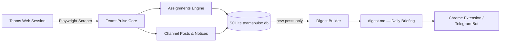

# TeamsPulse 🎓⚡

> **Turn chaotic Microsoft Teams courses into a clean, automated academic briefing.**  
> Scrapes classes, tracks assignments, extracts Class Test (CT) dates, and delivers a unified daily digest — showing only what's **new since the last run**.

---

## 📌 The Problem

University students live inside Microsoft Teams, but finding what actually matters is a nightmare:
- **Cluttered Channels**: Important exam notices and Class Test (CT) announcements are buried under hundreds of messages and bot alerts.
- **Scattered Deadlines**: Assignments are tucked inside separate tabs across multiple teams and channels.
- **Admin-Locked APIs**: Microsoft Graph API requires administrative consent (`EduAssignments.*`, `EduRoster.*`), which universities generally block for student-built applications.
- **Heavy & Slow**: The Teams desktop/web app is sluggish to navigate when you just want a 10-second check on tomorrow's deadlines.
- **No Memory**: Every digest tool re-shows everything from the beginning of time. There's no "what's new since yesterday?"

---

## 💡 The Solution

**TeamsPulse** automates Microsoft Teams using Playwright and your own student session. It navigates your classes in the background, extracts structured assignment and announcement data, deduplicates across runs, and transforms noisy chat feeds into an actionable daily briefing.



---

## ✨ Features

- [x] **Multi-Class Navigation**: Automatically scans all enrolled university teams and classes.
- [x] **Deep Assignment Scraping**: Pierces the internal Microsoft Assignments iframe across all tabs:
  - ⏳ **Upcoming** · ⚠️ **Past due** · ✅ **Completed**
- [x] **Channel Post Scraping**: Extracts teacher announcements, file uploads, and bot notifications from the `General` channel per class.
- [x] **Rule-Based Digest**: Keyword + regex classification (CT/Quiz, Exam, Deadline, Grades, Reschedule, Cancelled) — no AI required, works offline.
- [x] **Storage & Deduplication**: SQLite (`teamspulse.db`) stores a SHA-256 fingerprint for every processed post. On the next run, already-seen posts are silently skipped — only genuinely new content appears in the digest.
- [x] **Resilient UI Selectors**: Bypasses unstable Fluent UI atomic class names by anchoring to semantic `data-testid` / `data-test` / ARIA attributes.
- [ ] **AI-Powered Parser**: Gemini Flash to extract structured dates, rooms, and syllabi from free-text posts.
- [x] **Chrome / Edge Extension**: Quick popup showing today's deadlines, upcoming CTs, and new notices (served by the local API on port 3457).
- [ ] **Telegram Bot**: Morning briefing push notifications.

---

## 🚀 Quickstart

### 1. Prerequisites
- **Node.js** v24 or higher — the dedup store uses the built-in `node:sqlite`
  module, which does not exist before Node 22.5 and still prints an
  `ExperimentalWarning` on 22.x. There is no `better-sqlite3` dependency.
- **npm**

### 2. Installation

```bash
git clone https://github.com/Sa-Alfy/teampulse.git
cd teampulse
npm install   # postinstall downloads the Chromium build Playwright needs
```

If you skipped the postinstall (or it failed behind a proxy), run it yourself:

```bash
npm run setup
```

### 3. One-Time Login (Session Capture)

```bash
npm run login
```

- A visible Chromium browser window opens.
- Log in with your university credentials and complete MFA.
- Once your Teams dashboard is fully visible, press **ENTER** in the terminal.
- Your session is saved locally to `auth-teams.json`.

> ⚠️ **Security Warning**: `auth-teams.json` contains active session tokens. **Never share or commit this file.** It is excluded by `.gitignore`.

### 4. Daily Workflow

```bash
npm run daily     # scrape + digest in one step
```

Or run the two halves separately:

```bash
npm run scrape    # Pull fresh data from Teams  → notices.json + assignments.json
npm run digest    # Build the briefing           → digest.md
```

Open `digest.md`: each class shows **New since last run** first, then
**Still standing** so the briefing is still readable an hour later. Every run is
also archived to `digests/YYYY-MM-DD.md`.

#### Useful flags

```bash
npm run scrape -- --headed              # watch the browser work (debugging)
npm run scrape -- --class "CSE 312"     # scrape one class only
npm run scrape:posts -- --hours 48      # only posts from the last 48h
npm run scrape:posts -- --scrollback 20 # dig further back through channel history
npm run digest -- --hours 24            # build a digest from the last 24h only
```

Run the unit tests for the parsing rules with `npm test`.

---

## 📂 Output Format

### `notices.json` — raw channel posts per class

```json
[
  {
    "className": "Summer_2026_CSE 312 (V1)_232_D4",
    "posts": [
      {
        "author": "A. Instructor",
        "isAnnouncement": true,
        "subject": "CT-2 Schedule",
        "body": "CT-2 will be held on 20.09.2025 at 9:30 AM.",
        "timestampIso": "2025-09-14T08:12:00.000Z"
      }
    ]
  }
]
```

### `digest.md` — daily briefing

A Markdown table grouped by class, showing only posts that are new since the last run:

```
# TeamsPulse Digest

_Generated 2025-09-15T… — rule-based, no AI involved._
_3 new since last run; 23 still standing across 5 class(es)._

## Summer_2026_CSE 312 (V1)_232_D4

### 🆕 New since last run

| Date       | Time     | Type        | Summary                         | Source               |
|------------|----------|-------------|---------------------------------|----------------------|
| 2025-09-20 | 9:30 AM  | 🧪 CT/Quiz  | CT-2 will be held on 20.09…     | A. Instructor, Sep 14 |
```

A redacted sample lives in [`digest.example.md`](digest.example.md). Your real
`digest.md` and `digests/` are gitignored — they carry your actual course names,
instructors and deadlines.

### `teamspulse.db` — deduplication store

SQLite database (excluded from git), written through Node's built-in
`node:sqlite` — there is no `better-sqlite3` dependency.

Each post is fingerprinted with
`sha256(rawClassName, author, timestamp, subject, body[:500])`. All five fields
matter: drop any of them and two genuinely different posts collapse into one,
and the loser is suppressed forever.

Posts are recorded in two states. `surfaced = 1` means the post actually
appeared in a digest and will be suppressed next run; `surfaced = 0` means it
was scraped but filtered out as not noteworthy. Only surfaced posts count as
seen, so loosening the classifier later can still bring the others through.

```bash
# See all surfaced posts
node -e "const {DatabaseSync}=require('node:sqlite'); const d=new DatabaseSync('teamspulse.db',{readOnly:true}); console.table(d.prepare('SELECT class_name,author,snippet,seen_at FROM posts WHERE surfaced=1 ORDER BY seen_at DESC LIMIT 20').all())"
```

> The hash tuple is versioned (`PRAGMA user_version`). Changing it drops the old
> table on next run: previously-seen posts reappear once, which is the safe
> direction — re-showing a notice is recoverable, hiding one is not.

---

## 🧩 Chrome Extension

TeamsPulse includes a lightweight Chrome/Edge Extension (Manifest V3) that provides a fast, dark-themed academic briefing popup without needing to open Microsoft Teams.

### Features
* 📚 **Categorized by Class**: See notices and assignments cleanly organized under each enrolled course (`CSE 312`, `PHY 104`, `MAT 103`, etc.).
* 📑 **Category Switcher**: One-click tabs to switch between **All**, **📢 Notices**, and **📝 Tasks**.
* 🔍 **Instant Search**: Filter notices, exams, CTs, teachers, and tasks in real time as you type.
* 🟢 **Live Auto-Sync**: Automatically polls the local server every 15 seconds with an animated `● Live` status badge and last sync ticker.
* 🏷️ **Color-Coded Badges**: Distinct visual tags for `🧪 CT/Quiz`, `📝 Exam`, `📌 Deadline`, `🎤 Presentation`, `📊 Grades`, and `🔄 Reschedule`.
* ⏳ **Task Tracking**: Highlights `⚠️ Past Due` and `⏳ Upcoming` assignments with due dates.

### Setup Instructions:
1. **Start the local API server**:
   ```bash
   npm run server
   ```
   This serves your scraped notices and assignments locally at `http://localhost:3457` (with a friendly web dashboard and CORS enabled for extensions).

2. **Install the extension in your browser**:
   - Open Chrome or Edge and navigate to `chrome://extensions`
   - Enable **Developer mode** (toggle in the top-right corner)
   - Click **Load unpacked**
   - Select the `extension/` folder inside your TeamsPulse directory

3. **Pin & Use**:
   - Pin the ⚡ **TeamsPulse** extension to your browser toolbar.
   - Click the extension icon to view today's deadlines, upcoming CTs/quizzes, and class announcements.
   - Filter by specific class or time range (`All Time` by default, `Last 24h`, `Last 48h`, `Last 7 days`).
   - Hit 🔄 to refresh anytime after running `npm run scrape`.

---

## 🗺️ Roadmap

### ✅ Phase 1: Core Scraper
- [x] Multi-class assignment scraper with iframe piercing.
- [x] Channel `Posts` scraper for the `General` channel (announcements, bot posts, file uploads).
- [x] Resilient UI selectors (semantic `data-testid`, ARIA, not fragile atomic CSS classes).

### ✅ Phase 2: Intelligence & Data Layer
- [x] Rule-based digest builder — keyword + regex classification, zero AI dependency.
- [x] **SQLite storage & deduplication** — SHA-256 fingerprint per post, skips seen items on every run.

### ✅ Phase 3: Client Interface (UI)
- [x] **Chrome / Edge Extension**: Fast popup showing today's deadlines, upcoming CTs, and new notices via local API server.
- [x] **Course Categorization & Live Sync**: Auto-polling, category tabs, instant search, and dark mode design.

### 🔲 Phase 4: Zero-Install Distribution & Notifications
- [ ] **Pure Web Store Extension**: In-browser content script reading `teams.microsoft.com` with zero Node.js/server requirement.
- [ ] **1-Click Portable Runner**: Double-click `.bat` with embedded portable Node for frictionless classmate sharing.
- [ ] Telegram / Discord bot webhooks for morning briefings.

---

## 🛠️ Technical Insights

- **Why Not Microsoft Graph API?**  
  Single-tenant education tenants enforce strict blanket policies blocking end-user consent. Scopes like `EduAssignments.Read` require tenant admin approval. Playwright automates the real student session without needing IT permissions.

- **Fluent UI Atomic Classes**:  
  Teams uses dynamically hashed classes (e.g. `f22iagw`, `rfxo2k2`) that break across builds. TeamsPulse exclusively relies on `data-testid`, `data-test`, `role`, and structural container IDs like `#classroom`.

- **Iframe Sandboxing**:  
  Assignments are hosted in a separate origin iframe (`assignments.edu.cloud.microsoft`). Playwright's `frameLocator` pierces the sandbox to interact with internal tab buttons and cards.

- **Deduplication Hash**:  
  `sha256(className + "\0" + timestampIso + "\0" + body[:500])` — null-byte separators prevent field-boundary collisions. Body is capped at 500 chars so transient "Loading..." states don't create diverging hashes on retry runs.

- **Crash-Safe Write Order**:  
  `digest.md` is written before hashes are persisted to `teamspulse.db`. A crash mid-write means posts reappear on the next run rather than being silently swallowed.

---

## 🛡️ License

This project is licensed under the [MIT License](LICENSE).
