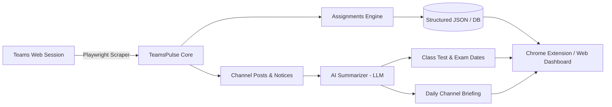

# TeamsPulse 🎓⚡

> **Turn chaotic Microsoft Teams courses into a clean, automated academic briefing.**  
> Scrapes classes, tracks assignments, extracts Class Test (CT) dates, and delivers a unified daily digest for students.

---

## 📌 The Problem

University students live inside Microsoft Teams, but finding what actually matters is a nightmare:
- **Cluttered Channels**: Important exam notices and Class Test (CT) announcements are buried under hundreds of messages and bot alerts.
- **Scattered Deadlines**: Assignments are tucked inside separate tabs across multiple teams and channels.
- **Admin-Locked APIs**: Microsoft Graph API requires administrative consent (`EduAssignments.*`, `EduRoster.*`), which universities generally block for student-built applications.
- **Heavy & Slow**: The Teams desktop/web app is sluggish to navigate when you just want a 10-second check on tomorrow's deadlines.

---

## 💡 The Solution

**TeamsPulse** automates Microsoft Teams using Playwright and your own student session. It navigates your classes in the background, extracts structured assignment and announcement data, and transforms noisy chat feeds into an actionable daily briefing.



---

## ✨ Features (Current & In-Progress)

- [x] **Multi-Class Navigation**: Automatically scans all enrolled university teams and classes.
- [x] **Deep Assignment Scraping**: Pierces the internal Microsoft Assignments iframe (`assignments.edu.cloud.microsoft`) across all tabs:
  - ⏳ **Upcoming**
  - ⚠️ **Past due**
  - ✅ **Completed**
- [x] **Resilient UI Selectors**: Bypasses unstable Fluent UI atomic class names by anchoring to semantic container IDs (`#classroom`, `[data-testid="team-name"]`, `[data-test="assignment-card"]`).
- [x] **Empty-State Tolerance**: Handles courses with zero assignments without timing out.
- [ ] **Channel Posts & Notice Scraping**: Extracts recent teacher announcements and file uploads from the `General` channel.
- [ ] **AI-Powered CT & Exam Parser**: Uses Gemini Flash to parse free-text teacher posts into structured dates, rooms, and syllabi.
- [ ] **Daily Digest**: Generates a unified morning brief of what happened across all course chats.
- [ ] **Student-Facing Interface**: Chrome / Edge Extension and Web Dashboard.

---

## 🚀 Quickstart

### 1. Prerequisites
- **Node.js** (v18 or higher recommended)
- **npm**

### 2. Installation

Clone the repository and install dependencies:

```bash
git clone https://github.com/Sa-Alfy/teampulse.git
cd teampulse
npm install
npx playwright install chromium
```

### 3. One-Time Login (Session Capture)

Run the login script to authenticate with your university Microsoft account:

```bash
npm run login
```

- A visible Chromium browser window will open.
- Log in with your university credentials and complete any two-factor authentication (MFA/Authenticator).
- Once your Teams dashboard and class list are fully visible, return to the terminal and press **ENTER**.
- Your authenticated session is saved locally to `auth-teams.json`.

> ⚠️ **Security Warning**: `auth-teams.json` contains active session tokens. **Never share or commit this file to version control.** It is already excluded by `.gitignore`.

### 4. Run the Scraper

Run the scraper to collect assignments across all your classes:

```bash
npm run scrape
```

Output will be saved to `assignments.json`.

---

## 📂 Output Format

`assignments.json` generates structured data like this:

```json
[
  {
    "className": "Summer_2026_CSE 312 (V1)_ 232_D4",
    "assignments": [
      {
        "tab": "Past due",
        "title": "Project Submission",
        "details": "Due at 11:59 PM",
        "status": ""
      },
      {
        "tab": "Completed",
        "title": "Lab Final",
        "details": "Submitted at 1:31 PM",
        "status": "Turned in"
      }
    ]
  },
  {
    "className": "Summer_2026_CSE 304 (V1)_242_D1",
    "assignments": []
  }
]
```

---

## 🗺️ Roadmap

### Phase 1: Core Scraper (In Progress)
- [x] Multi-class assignment scraper.
- [x] In-app back navigation (`All teams`) and iframe handling.
- [ ] Inspect and scrape channel `Posts` from `General` channel.
- [ ] Activity feed parser for @mentions and global notices.

### Phase 2: Intelligence & Data Layer
- [ ] Add SQLite / local storage layer with item hashing for deduplication (only notify on *new* items).
- [ ] AI prompt integration (Gemini Flash) to extract:
  - Class Test (CT) dates, times, rooms, and syllabi.
  - Class cancellations or schedule changes.
  - 3-bullet daily digest per course.

### Phase 3: Client Interface (UI)
- [ ] **Chrome / Edge Extension**:
  - Leverages the student's existing web session directly (zero MFA hurdles).
  - Quick popup showing today's deadlines, upcoming CTs, and unread notices.
- [ ] **Web Dashboard**: Clean, responsive view for desktop and mobile.

### Phase 4: Push Notifications & Integrations
- [ ] Telegram / Discord bot webhooks for morning briefings.
- [ ] "Add to Google Calendar / Outlook" one-click export for CTs and assignment deadlines.

---

## 🛠️ Technical Insights

- **Why Not Microsoft Graph API?**  
  Single-tenant education tenants (like universities) often enforce strict blanket policies blocking end-user consent. Scopes like `EduAssignments.Read` require tenant admin approval. Playwright automates the real student session legitimately without needing IT permissions.
- **Fluent UI Atomic Classes**:  
  Teams uses dynamically hashed classes (e.g. `f22iagw`, `rfxo2k2`) that break across builds. TeamsPulse exclusively relies on semantic class fragments (`.fui-CardHeader__header`), structural landmarks (`#classroom`, `[role="treeitem"]`), and `data-test` attributes.
- **Iframe Sandboxing**:  
  Assignments are hosted in a separate origin iframe (`assignments.edu.cloud.microsoft`). Playwright's `frameLocator` is used to pierce and interact with internal tab buttons and cards.

---

## 🛡️ License

This project is licensed under the [MIT License](LICENSE).

