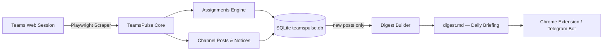

# TeamsPulse 🎓⚡

> **Turn chaotic Microsoft Teams courses into a clean, automated academic briefing.**  
> Scrapes classes, tracks assignments, extracts Class Test (CT) dates, and delivers a unified daily digest — showing only what's **new since the last run**.

---

## 📌 The Problem

University students live inside Microsoft Teams, but finding what actually matters is a nightmare:
- **Cluttered Channels**: Important exam notices and Class Test (CT) announcements are buried under hundreds of messages and bot alerts.
- **Scattered Deadlines**: Assignments are tucked inside separate tabs across multiple teams and channels.
- **Admin-Locked APIs**: Microsoft Graph API requires administrative consent (`EduAssignments.*`, `EduRoster.*`), which universities generally block for student-built applications.
- **Heavy & Slow**: The Teams desktop/web app is sluggish to navigate when you just want a 10-second check on tomorrow's deadlines.
- **No Memory**: Every digest tool re-shows everything from the beginning of time. There's no "what's new since yesterday?"

---

## 💡 The Solution

**TeamsPulse** automates Microsoft Teams using Playwright and your own student session. It navigates your classes in the background, extracts structured assignment and announcement data, deduplicates across runs, and transforms noisy chat feeds into an actionable daily briefing.



---

## ✨ Features

- [x] **Multi-Class Navigation**: Automatically scans all enrolled university teams and classes.
- [x] **Deep Assignment Scraping**: Pierces the internal Microsoft Assignments iframe across all tabs:
  - ⏳ **Upcoming** · ⚠️ **Past due** · ✅ **Completed**
- [x] **Channel Post Scraping**: Extracts teacher announcements, file uploads, and bot notifications from the `General` channel per class.
- [x] **Rule-Based Digest**: Keyword + regex classification (CT/Quiz, Exam, Deadline, Grades, Reschedule, Cancelled) — no AI required, works offline.
- [x] **Storage & Deduplication**: SQLite (`teamspulse.db`) stores a SHA-256 fingerprint for every processed post. On the next run, already-seen posts are silently skipped — only genuinely new content appears in the digest.
- [x] **Resilient UI Selectors**: Bypasses unstable Fluent UI atomic class names by anchoring to semantic `data-testid` / `data-test` / ARIA attributes.
- [ ] **AI-Powered Parser**: Gemini Flash to extract structured dates, rooms, and syllabi from free-text posts.
- [ ] **Chrome / Edge Extension**: Quick popup showing today's deadlines, upcoming CTs, and new notices.
- [ ] **Telegram Bot**: Morning briefing push notifications.

---

## 🚀 Quickstart

### 1. Prerequisites
- **Node.js** v18 or higher
- **npm**

### 2. Installation

```bash
git clone https://github.com/Sa-Alfy/teampulse.git
cd teampulse
npm install
npx playwright install chromium
```

### 3. One-Time Login (Session Capture)

```bash
npm run login
```

- A visible Chromium browser window opens.
- Log in with your university credentials and complete MFA.
- Once your Teams dashboard is fully visible, press **ENTER** in the terminal.
- Your session is saved locally to `auth-teams.json`.

> ⚠️ **Security Warning**: `auth-teams.json` contains active session tokens. **Never share or commit this file.** It is excluded by `.gitignore`.

### 4. Daily Workflow

```bash
npm run scrape    # Pull fresh data from Teams  → notices.json + assignments.json
npm run digest    # Build the briefing           → digest.md  (new posts only)
```

That's it. Open `digest.md` to see only what changed since your last run.

---

## 📂 Output Format

### `notices.json` — raw channel posts per class

```json
[
  {
    "className": "Summer_2026_CSE 312 (V1)_232_D4",
    "posts": [
      {
        "author": "Dr. Rahman",
        "isAnnouncement": true,
        "subject": "CT-2 Schedule",
        "body": "CT-2 will be held on 20.09.2025 at 9:30 AM.",
        "timestampIso": "2025-09-14T08:12:00.000Z"
      }
    ]
  }
]
```

### `digest.md` — daily briefing

A Markdown table grouped by class, showing only posts that are new since the last run:

```
# TeamsPulse Digest

_Generated 2025-09-15T… — rule-based, no AI involved._
_3 new post(s) across 5 class(es); 23 duplicate(s) suppressed._

## CSE 312

### Notices & Announcements

| Date       | Time     | Type        | Summary                         | Source               |
|------------|----------|-------------|---------------------------------|----------------------|
| 2025-09-20 | 9:30 AM  | 🧪 CT/Quiz  | CT-2 will be held on 20.09…     | Dr. Rahman, Sep 14   |
```

### `teamspulse.db` — deduplication store

SQLite database (excluded from git). Each post is stored by its SHA-256 hash after first being processed. Queryable:

```bash
# See all stored posts
node -e "const D=require('better-sqlite3')('teamspulse.db'); console.table(D.prepare('SELECT class_name,author,snippet,seen_at FROM posts ORDER BY seen_at DESC LIMIT 20').all())"
```

---

## 🗺️ Roadmap

### ✅ Phase 1: Core Scraper
- [x] Multi-class assignment scraper with iframe piercing.
- [x] Channel `Posts` scraper for the `General` channel (announcements, bot posts, file uploads).
- [x] Resilient UI selectors (semantic `data-testid`, ARIA, not fragile atomic CSS classes).

### ✅ Phase 2: Intelligence & Data Layer
- [x] Rule-based digest builder — keyword + regex classification, zero AI dependency.
- [x] **SQLite storage & deduplication** — SHA-256 fingerprint per post, skips seen items on every run.

### 🔲 Phase 3: Client Interface (UI)
- [ ] **Chrome / Edge Extension**: Leverages the student's existing web session (zero MFA hurdles). Quick popup showing today's deadlines, upcoming CTs, and unread notices.
- [ ] **Web Dashboard**: Clean, responsive view for desktop and mobile.

### 🔲 Phase 4: Push Notifications & Integrations
- [ ] Telegram / Discord bot webhooks for morning briefings.
- [ ] One-click export to Google Calendar / Outlook for CTs and assignment deadlines.

---

## 🛠️ Technical Insights

- **Why Not Microsoft Graph API?**  
  Single-tenant education tenants enforce strict blanket policies blocking end-user consent. Scopes like `EduAssignments.Read` require tenant admin approval. Playwright automates the real student session without needing IT permissions.

- **Fluent UI Atomic Classes**:  
  Teams uses dynamically hashed classes (e.g. `f22iagw`, `rfxo2k2`) that break across builds. TeamsPulse exclusively relies on `data-testid`, `data-test`, `role`, and structural container IDs like `#classroom`.

- **Iframe Sandboxing**:  
  Assignments are hosted in a separate origin iframe (`assignments.edu.cloud.microsoft`). Playwright's `frameLocator` pierces the sandbox to interact with internal tab buttons and cards.

- **Deduplication Hash**:  
  `sha256(className + "\0" + timestampIso + "\0" + body[:500])` — null-byte separators prevent field-boundary collisions. Body is capped at 500 chars so transient "Loading..." states don't create diverging hashes on retry runs.

- **Crash-Safe Write Order**:  
  `digest.md` is written before hashes are persisted to `teamspulse.db`. A crash mid-write means posts reappear on the next run rather than being silently swallowed.

---

## 🛡️ License

This project is licensed under the [MIT License](LICENSE).
