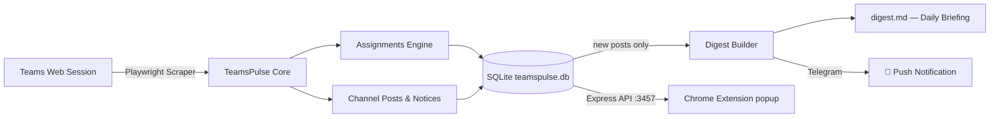
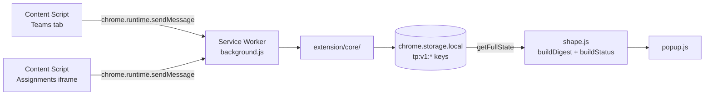

# TeamsPulse 🎓⚡

> **Turn chaotic Microsoft Teams courses into a clean, automated academic briefing.**  
> Scrapes classes, tracks assignments, extracts Class Test (CT) dates, and delivers a unified daily digest — showing only what's **new since the last run**.
> 
> **⚡ Phase 1 of the standalone extension is in progress on `feat/standalone-extension`.**

---

## 📌 The Problem

University students live inside Microsoft Teams, but finding what actually matters is a nightmare:
- **Cluttered Channels**: Important exam notices and Class Test (CT) announcements are buried under hundreds of messages and bot alerts.
- **Scattered Deadlines**: Assignments are tucked inside separate tabs across multiple teams and channels.
- **Admin-Locked APIs**: Microsoft Graph API requires administrative consent (`EduAssignments.*`, `EduRoster.*`), which universities generally block for student-built applications.
- **Heavy & Slow**: The Teams desktop/web app is sluggish to navigate when you just want a 10-second check on tomorrow's deadlines.
- **No Memory**: Every digest tool re-shows everything from the beginning of time. There's no "what's new since yesterday?"

---

## 💡 The Solution

**TeamsPulse** automates Microsoft Teams using Playwright and your own student session. It navigates your classes in the background, extracts structured assignment and announcement data, deduplicates across runs, and transforms noisy chat feeds into an actionable daily briefing.

### Current architecture (server-assisted mode — fully working)


```mermaid
flowchart LR
    A[Teams Web Session] -->|Playwright Scraper| B[TeamsPulse Core]
    B --> C[Assignments Engine]
    B --> D[Channel Posts & Notices]
    C --> E[(SQLite teamspulse.db)]
    D --> E
    E -->|new posts only| F[Digest Builder]
    F --> G[digest.md — Daily Briefing]
    F -->|Telegram| H[📱 Push Notification]
    E -->|Express API :3457| I[Chrome Extension popup]
```

### Standalone extension architecture (in progress — `feat/standalone-extension`)


```mermaid
flowchart LR
    CS1[Content Script\nTeams tab] -->|chrome.runtime.sendMessage| SW[Service Worker\nbackground.js]
    CS2[Content Script\nAssignments iframe] -->|chrome.runtime.sendMessage| SW
    SW --> CORE[extension/core/]
    CORE --> ST[(chrome.storage.local\ntp:v1:* keys)]
    ST -->|getFullState| SH[shape.js\nbuildDigest + buildStatus]
    SH --> POP[popup.js]
```

---

## ✨ Features

- [x] **Multi-Class Navigation**: Automatically scans all enrolled university teams and classes.
- [x] **Deep Assignment Scraping**: Pierces the internal Microsoft Assignments iframe across all tabs:
  - ⏳ **Upcoming** · ⚠️ **Past due** · ✅ **Completed**
- [x] **Channel Post Scraping**: Extracts teacher announcements, file uploads, and bot notifications from the `General` channel per class.
- [x] **Rule-Based Digest**: Keyword + regex classification (CT/Quiz, Exam, Deadline, Grades, Reschedule, Cancelled) — no AI required, works offline.
- [x] **Storage & Deduplication**: SQLite (`teamspulse.db`) stores a SHA-256 fingerprint for every processed post. On the next run, already-seen posts are silently skipped — only genuinely new content appears in the digest.
- [x] **Resilient UI Selectors**: Bypasses unstable Fluent UI atomic class names by anchoring to semantic `data-testid` / `data-test` / ARIA attributes.
- [x] **Chrome / Edge Extension**: Quick popup showing today's deadlines, upcoming CTs, and new notices (served by the local API on port 3457).
- [x] **Telegram Bot**: Morning briefing push notifications.
- [x] **Browser-safe core** (`extension/core/`): `fingerprint.js`, `store.js`, `shape.js` — SubtleCrypto, `chrome.storage.local`, zero Node-only APIs. (Phase 1 complete)
- [ ] **Standalone Extension**: Content scripts read Teams directly; no server, no Node.js required for end users. (Phase 2–3 in progress)

---

## 📂 Project Structure

```
teampulse/
├── extension/
│   ├── core/                        ← browser-safe shared modules (NEW)
│   │   ├── digest-utils.js          ← canonical copy of parsing rules (dual export)
│   │   ├── fingerprint.js           ← SubtleCrypto SHA-256, fingerprintString
│   │   ├── store.js                 ← chrome.storage.local store + memoryBackend
│   │   └── shape.js                 ← buildDigest, buildStatus, transformPost, …
│   ├── manifest.json                ← MV3 manifest
│   ├── background.js                ← service worker (ephemeral, no in-memory state)
│   ├── popup.html / popup.css / popup.js
│   └── icons/
├── test/
│   ├── core.test.js                 ← Phase 1 tests (fingerprint parity, store, shape)
│   ├── assignment-sort.test.js
│   ├── digest-utils.test.js
│   ├── hash-post.test.js
│   └── notify.test.js
├── db.js                            ← SQLite layer (Node only; hashPost delegates to fingerprint.js)
├── digest-utils.js                  ← one-line shim → extension/core/digest-utils.js
├── build-digest.js                  ← CLI digest builder
├── server.js                        ← local Express API (server-assisted mode)
├── teams.js / scrape-posts.js       ← Playwright scrapers
├── notify.js                        ← Telegram push
└── PROJECT_CONTEXT.md               ← full technical architecture (read this first)
```

---

## 🚀 Quickstart

### 1. Prerequisites
- **Node.js** v24 or higher — the dedup store uses the built-in `node:sqlite`
  module, which does not exist before Node 22.5 and still prints an
  `ExperimentalWarning` on 22.x. There is no `better-sqlite3` dependency.
- **npm**

### 2. Installation

```bash
git clone https://github.com/Sa-Alfy/teampulse.git
cd teampulse
npm install   # postinstall downloads the Chromium build Playwright needs
```

If you skipped the postinstall (or it failed behind a proxy), run it yourself:

```bash
npm run setup
```

### 3. One-Time Login (Session Capture)

```bash
npm run login
```

- A visible Chromium browser window opens.
- Log in with your university credentials and complete MFA.
- Once your Teams dashboard is fully visible, press **ENTER** in the terminal.
- Your session is saved locally to `auth-teams.json`.

> ⚠️ **Security Warning**: `auth-teams.json` contains active session tokens. **Never share or commit this file.** It is excluded by `.gitignore`.

### 4. Daily Workflow

```bash
npm run daily     # scrape + digest in one step
```

Or run the two halves separately:

```bash
npm run scrape    # Pull fresh data from Teams  → notices.json + assignments.json
npm run digest    # Build the briefing           → digest.md
```

Open `digest.md`: each class shows **New since last run** first, then
**Still standing** so the briefing is still readable an hour later. Every run is
also archived to `digests/YYYY-MM-DD.md`.

#### Useful flags

```bash
npm run scrape -- --headed              # watch the browser work (debugging)
npm run scrape -- --class "CSE 312"     # scrape one class only
npm run scrape:posts -- --hours 48      # only posts from the last 48h
npm run scrape:posts -- --scrollback 20 # dig further back through channel history
npm run digest -- --hours 24            # build a digest from the last 24h only
```

Run the unit tests with `npm test` (56 tests, all passing).

### Telegram Push (optional)
1. Create a bot with [@BotFather](https://t.me/BotFather) and copy your bot token.
2. Message your bot and get your numeric chat ID (e.g. from `@userinfobot`).
3. Copy `.env.example` to `.env` and fill in `TELEGRAM_BOT_TOKEN` and `TELEGRAM_CHAT_ID`.
4. Test delivery anytime with `node notify.js --test`.

---

## 🧩 Chrome Extension — Current Setup (server-assisted)

TeamsPulse includes a lightweight Chrome/Edge Extension (Manifest V3) that provides a fast, dark-themed academic briefing popup without needing to open Microsoft Teams.

### Setup Instructions
1. **Start the local API server**:
   ```bash
   npm run server
   ```
   This serves your scraped notices and assignments locally at `http://localhost:3457`.

2. **Install the extension in your browser**:
   - Open Chrome or Edge and navigate to `chrome://extensions`
   - Enable **Developer mode** (toggle in the top-right corner)
   - Click **Load unpacked**
   - Select the `extension/` folder inside your TeamsPulse directory

3. **Pin & Use**:
   - Pin the ⚡ **TeamsPulse** extension to your browser toolbar.
   - Click the extension icon to view today's deadlines, upcoming CTs/quizzes, and class announcements.

### Features
* 📚 **Categorized by Class**: Notices and assignments grouped under each enrolled course.
* 📑 **Category Switcher**: Tabs for **All**, **📢 Notices**, and **📝 Tasks**.
* 🔍 **Collapsible Filter Bar**: Class/time filters and search, hidden by default.
* 🎯 **Instant Search**: Real-time filtering across classes, tags, summaries, authors.
* 🟢 **Live Auto-Sync**: Polls every 15s with animated `● Live` badge and last sync ticker.
* ⏳ **Due-Soon Urgency**: Assignments due within 48 h get an amber highlight.
* 💾 **Remembered Collapse State**: Expanded/collapsed state persisted via `chrome.storage.local`.

---

## 📂 Output Format

### `notices.json` — raw channel posts per class

```json
[
  {
    "className": "Summer_2026_CSE 312 (V1)_232_D4",
    "posts": [
      {
        "author": "A. Instructor",
        "isAnnouncement": true,
        "subject": "CT-2 Schedule",
        "body": "CT-2 will be held on 20.09.2025 at 9:30 AM.",
        "timestampIso": "2025-09-14T08:12:00.000Z"
      }
    ]
  }
]
```

### `teamspulse.db` — deduplication store

SQLite database (excluded from git), written through Node's built-in `node:sqlite`.

Each post is fingerprinted with
`sha256(rawClassName + "\0" + author + "\0" + timestampIso + "\0" + subject + "\0" + body[:500])`.
All five fields matter. The raw string is produced by `fingerprintString()` in
`extension/core/fingerprint.js` — both `db.js` (Node/sync) and the browser extension
(SubtleCrypto/async) use the same function, guaranteeing identical hashes.

Posts are recorded in two states: `surfaced = 1` means the post appeared in a digest
and will be suppressed next run; `surfaced = 0` means it was filtered out. Only
surfaced posts count as seen, so loosening the classifier later can still recover them.

---

## 🗺️ Roadmap

### ✅ Phase 1: Core Scraper
- [x] Multi-class assignment scraper with iframe piercing.
- [x] Channel `Posts` scraper for the `General` channel.
- [x] Resilient UI selectors (semantic `data-testid`, ARIA).

### ✅ Phase 2: Intelligence & Data Layer
- [x] Rule-based digest builder — keyword + regex classification.
- [x] **SQLite storage & deduplication** — SHA-256 fingerprint per post, skips seen items.

### ✅ Phase 3: Client Interface (server-assisted)
- [x] **Chrome / Edge Extension**: Fast popup via local API server on port 3457.
- [x] **Telegram Push**: Morning briefing via `notify.js`.

### 🔄 Phase 4: Standalone Extension (in progress — `feat/standalone-extension`)
- [x] `extension/core/digest-utils.js` — canonical dual-export parsing module
- [x] `extension/core/fingerprint.js` — `fingerprintString` + async `sha256Hex` (SubtleCrypto)
- [x] `extension/core/store.js` — `createStore(backend)` with `chromeBackend` + `memoryBackend`, promise-queued writes, 200-post cap, filter-first/dedup-second semantics
- [x] `extension/core/shape.js` — `buildDigest`, `buildStatus`, `transformPost`, `transformAssignment`, `compareAssignments`
- [x] `test/core.test.js` — 14 new tests (56 total, all passing)
- [ ] Content scripts: Teams tab scraper + Assignments iframe scraper (Phase 2)
- [ ] Background service worker: message routing + store ingestion (Phase 2)
- [ ] Manifest update + popup wired to standalone path (Phase 3)

### 🔲 Phase 5: Distribution
- [ ] **Chrome Web Store**: Packaged standalone extension (no server required for end users).
- [ ] **1-Click Portable Runner**: Double-click `.bat` with embedded portable Node.

---

## 🛠️ Technical Insights

- **Why Not Microsoft Graph API?**  
  Single-tenant education tenants enforce strict blanket policies blocking end-user consent. Scopes like `EduAssignments.Read` require tenant admin approval. Playwright automates the real student session without needing IT permissions.

- **Fluent UI Atomic Classes**:  
  Teams uses dynamically hashed classes (e.g. `f22iagw`, `rfxo2k2`) that break across builds. TeamsPulse exclusively relies on `data-testid`, `data-test`, `role`, and structural container IDs like `#classroom`.

- **Iframe Sandboxing**:  
  Assignments are hosted in a separate origin iframe (`assignments.edu.cloud.microsoft`). Playwright's `frameLocator` pierces the sandbox to interact with internal tab buttons and cards.

- **Fingerprint Tuple**:  
  `sha256(className + "\0" + author + "\0" + ts + "\0" + subject + "\0" + body[:500])` — five fields, null-byte separated, body capped at 500 chars. Defined once in `extension/core/fingerprint.js`; `db.js` delegates to it so both environments are always identical.

- **Filter-First, Dedup-Second**:  
  Posts that fail `isNoteworthy()` are recorded with `surfaced=false` and never counted as seen. Improving the classifier in a future run can still surface them.

- **Crash-Safe Write Order**:  
  `digest.md` is written before hashes are persisted. A crash mid-write means posts reappear on the next run rather than being silently swallowed.

- **Promise Queue in Store**:  
  `extension/core/store.js` serialises all writes through a promise chain so concurrent ingests from two content scripts never produce a lost-update race.

---

## 🛡️ License

This project is licensed under the [MIT License](LICENSE).
