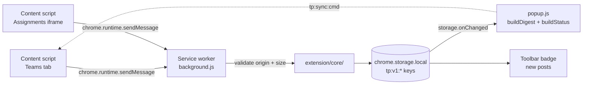
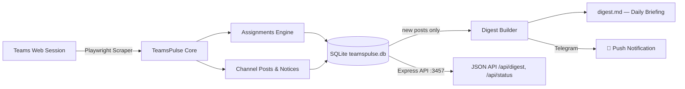

# TeamsPulse 🎓⚡

> **Turn chaotic Microsoft Teams courses into a clean, automated academic briefing.**  
> Scrapes classes, tracks assignments, extracts Class Test (CT) dates, and delivers a unified daily digest — showing only what's **new since the last run**.
> 
> **Status (2026-10-01, [v0.6.0 pre-release](https://github.com/Sa-Alfy/teampulse/releases/tag/v0.6.0)):** the browser extension works on its own — no server, no Node.js. Live capture of channel posts has been seen working on `teams.cloud.microsoft` for one student account. Assignment capture and "Sync all classes" are **unverified on real Teams** (tested only against local mock pages). Not on the Chrome Web Store.

---

## 🧩 Install (no server needed)

1. Download `teamspulse-extension-<version>.zip` from [Releases](https://github.com/Sa-Alfy/teampulse/releases) and unzip it.
2. Open `chrome://extensions` (or `edge://extensions`) and turn on **Developer mode**.
3. Click **Load unpacked** and choose the unzipped folder (or this repo's `extension/` folder).
4. Open Microsoft Teams in that browser (reload the tab if it was already open) and visit your classes — or click **Sync all classes** in the popup.
5. Click the ⚡ icon for your briefing. Everything stays in your browser; the extension makes no network requests.

Self-hosting the Playwright scraper, digest and Telegram bot is optional — see [Advanced: self-host](#-advanced-self-host-playwright--digest--telegram).

---

## 📌 The Problem

University students live inside Microsoft Teams, but finding what actually matters is a nightmare:
- **Cluttered Channels**: Important exam notices and Class Test (CT) announcements are buried under hundreds of messages and bot alerts.
- **Scattered Deadlines**: Assignments are tucked inside separate tabs across multiple teams and channels.
- **Admin-Locked APIs**: Microsoft Graph API requires administrative consent (`EduAssignments.*`, `EduRoster.*`), which universities generally block for student-built applications.
- **Heavy & Slow**: The Teams desktop/web app is sluggish to navigate when you just want a 10-second check on tomorrow's deadlines.
- **No Memory**: Every digest tool re-shows everything from the beginning of time. There's no "what's new since yesterday?"

---

## 💡 The Solution

**TeamsPulse** reads the Teams pages you already have open in your own browser session, extracts structured assignment and announcement data, deduplicates across visits, and turns noisy chat feeds into an actionable briefing. It ships two ways: a standalone browser extension (recommended), and an optional self-hosted Playwright pipeline.

### Standalone extension (default)


```mermaid
flowchart LR
    CS1[Content script\nTeams tab] -->|chrome.runtime.sendMessage| SW[Service worker\nbackground.js]
    CS2[Content script\nAssignments iframe] -->|chrome.runtime.sendMessage| SW
    SW -->|validate origin + size| CORE[extension/core/]
    CORE --> ST[(chrome.storage.local\ntp:v1:* keys)]
    ST -->|storage.onChanged| POP[popup.js\nbuildDigest + buildStatus]
    ST --> BADGE[Toolbar badge\nnew posts]
    POP -.->|tp:sync:cmd| CS1
```

- Permissions: `alarms`, `storage`, `unlimitedStorage`. No host permissions, no `tabs`.
- CSP for extension pages: `connect-src 'none'` — the popup cannot make network requests.
- Content scripts run only on `teams.microsoft.com`, `teams.cloud.microsoft` and `assignments.edu.cloud.microsoft`.

### Self-host pipeline (advanced, optional)


```mermaid
flowchart LR
    A[Teams Web Session] -->|Playwright Scraper| B[TeamsPulse Core]
    B --> C[Assignments Engine]
    B --> D[Channel Posts & Notices]
    C --> E[(SQLite teamspulse.db)]
    D --> E
    E -->|new posts only| F[Digest Builder]
    F --> G[digest.md — Daily Briefing]
    F -->|Telegram| H[📱 Push Notification]
    E -->|Express API :3457| I[JSON API /api/digest, /api/status]
```

Both paths share the same parsing rules (`extension/core/digest-utils.js`) and post fingerprint (`extension/core/fingerprint.js`).

---

## ✨ Features

- [x] **Multi-Class Navigation**: Automatically scans all enrolled university teams and classes.
- [x] **Deep Assignment Scraping**: Pierces the internal Microsoft Assignments iframe across all tabs:
  - ⏳ **Upcoming** · ⚠️ **Past due** · ✅ **Completed**
- [x] **Channel Post Scraping**: Extracts teacher announcements, file uploads, and bot notifications from the `General` channel per class.
- [x] **Rule-Based Digest**: Keyword + regex classification (CT/Quiz, Exam, Deadline, Grades, Reschedule, Cancelled) — no AI required, works offline.
- [x] **Storage & Deduplication**: SQLite (`teamspulse.db`) stores a SHA-256 fingerprint for every processed post. On the next run, already-seen posts are silently skipped — only genuinely new content appears in the digest.
- [x] **Resilient UI Selectors**: Bypasses unstable Fluent UI atomic class names by anchoring to semantic `data-testid` / `data-test` / ARIA attributes.
- [x] **Standalone Chrome / Edge extension**: popup reads `chrome.storage.local` — no server or Node.js. Live-updates as you browse Teams; toolbar badge counts new posts (24 h window).
- [x] **Sync all classes**: one click opens each class in your Teams tab, captures it, and returns you where you were (hidden teams skipped). *Not yet tested on live Teams.*
- [x] **Scraper health**: if Teams changes its page and capture stops working, the popup says "Scraper may be out of date" instead of quietly showing old data.
- [x] **Clear stored data**: one button wipes everything the extension stored.
- [x] **Telegram Bot** (self-host): morning briefing push notifications.

---

## 📂 Project Structure

```
teampulse/
├── extension/
│   ├── core/                        ← browser-safe shared modules (dual export: Node + browser)
│   │   ├── digest-utils.js          ← canonical parsing rules (classify, extractDate, …)
│   │   ├── fingerprint.js           ← SubtleCrypto SHA-256, fingerprintString
│   │   ├── store.js                 ← chrome.storage.local store, scrape-health records
│   │   ├── messages.js              ← handleMessage: origin + size validation, TP_* router
│   │   └── shape.js                 ← buildDigest, buildStatus (+ scraper health)
│   ├── content/
│   │   ├── teams-top.js             ← class detection, posts, health, "Sync all classes"
│   │   └── assignments-frame.js     ← 3-tab loop → TP_ASSIGNMENTS
│   ├── manifest.json                ← MV3, alarms/storage/unlimitedStorage, strict CSP
│   ├── background.js                ← service worker: message router + badge
│   ├── popup.html / popup.css / popup.js
│   └── icons/
├── tools/
│   ├── dom-probe.js                 ← read-only console probe: channel view
│   └── dom-probe-teams-list.js      ← read-only console probe: classes grid
├── test/                            ← node --test unit tests
├── test-dom/                        ← Playwright DOM tests (npm run test:dom)
│   ├── runner.js / popup-xss.test.js
│   └── fixtures/                    ← channel, classes-grid and assignments mock pages
├── db.js                            ← SQLite layer (Node only; hashPost delegates to fingerprint.js)
├── digest-utils.js                  ← one-line shim → extension/core/digest-utils.js
├── build-digest.js                  ← CLI digest builder
├── server.js                        ← local Express JSON API (self-host)
├── teams.js / scrape-posts.js       ← Playwright scrapers
├── notify.js                        ← Telegram push
└── PROJECT_CONTEXT.md               ← full technical architecture (read this first)
```

---

## 🛠 Advanced: self-host (Playwright + digest + Telegram)

Optional. Runs the scraper on your machine on a schedule and produces `digest.md`, a Telegram push and a local JSON API. Not needed for the extension.

### 1. Prerequisites
- **Node.js** v24 or higher — the dedup store uses the built-in `node:sqlite`
  module, which does not exist before Node 22.5 and still prints an
  `ExperimentalWarning` on 22.x. There is no `better-sqlite3` dependency.
- **npm**

### 2. Installation

```bash
git clone https://github.com/Sa-Alfy/teampulse.git
cd teampulse
npm install   # postinstall downloads the Chromium build Playwright needs
```

If you skipped the postinstall (or it failed behind a proxy), run it yourself:

```bash
npm run setup
```

### 3. One-Time Login (Session Capture)

```bash
npm run login
```

- A visible Chromium browser window opens.
- Log in with your university credentials and complete MFA.
- Once your Teams dashboard is fully visible, press **ENTER** in the terminal.
- Your session is saved locally to `auth-teams.json`.

> ⚠️ **Security Warning**: `auth-teams.json` contains active session tokens. **Never share or commit this file.** It is excluded by `.gitignore`.

### 4. Daily Workflow

```bash
npm run daily     # scrape + digest in one step
```

Or run the two halves separately:

```bash
npm run scrape    # Pull fresh data from Teams  → notices.json + assignments.json
npm run digest    # Build the briefing           → digest.md
```

Open `digest.md`: each class shows **New since last run** first, then
**Still standing** so the briefing is still readable an hour later. Every run is
also archived to `digests/YYYY-MM-DD.md`.

#### Useful flags

```bash
npm run scrape -- --headed              # watch the browser work (debugging)
npm run scrape -- --class "CSE 312"     # scrape one class only
npm run scrape:posts -- --hours 48      # only posts from the last 48h
npm run scrape:posts -- --scrollback 20 # dig further back through channel history
npm run digest -- --hours 24            # build a digest from the last 24h only
```

Run unit tests with `npm test` (72 tests, all passing). Run DOM/integration tests with `npm run test:dom` (4 Playwright headless tests — fixtures prove port logic only, not live Teams DOM compatibility).

### Telegram Push (optional)
1. Create a bot with [@BotFather](https://t.me/BotFather) and copy your bot token.
2. Message your bot and get your numeric chat ID (e.g. from `@userinfobot`).
3. Copy `.env.example` to `.env` and fill in `TELEGRAM_BOT_TOKEN` and `TELEGRAM_CHAT_ID`.
4. Test delivery anytime with `node notify.js --test`.

---

### Local JSON API

`npm run server` serves the self-hosted data at `http://127.0.0.1:3457` (`/api/digest`, `/api/status`).
Since v0.6.0 the browser extension no longer reads this API — it keeps its own data in the browser.

---

## 🧩 Popup features

* 📚 **Categorized by Class**: Notices and assignments grouped under each enrolled course.
* 📑 **Category Switcher**: Tabs for **All**, **📢 Notices**, and **📝 Tasks**.
* 🔍 **Collapsible Filter Bar**: Class/time filters and search, hidden by default.
* 🟢 **Fresh / Stale pill**: "Data is old" banner after 36 h without a capture.
* 🔄 **Sync all classes** and **Clear stored data** buttons.
* ⏳ **Due-Soon Urgency**: Assignments due within 48 h get an amber highlight.
* 🛡️ **Untrusted text stays text**: scraped posts are rendered with `textContent` only (tested with XSS payloads).

---

## 📂 Output Format

### `notices.json` — raw channel posts per class

```json
[
  {
    "className": "Summer_2026_CSE 312 (V1)_232_D4",
    "posts": [
      {
        "author": "A. Instructor",
        "isAnnouncement": true,
        "subject": "CT-2 Schedule",
        "body": "CT-2 will be held on 20.09.2025 at 9:30 AM.",
        "timestampIso": "2025-09-14T08:12:00.000Z"
      }
    ]
  }
]
```

### `teamspulse.db` — deduplication store

SQLite database (excluded from git), written through Node's built-in `node:sqlite`.

Each post is fingerprinted with
`sha256(rawClassName + "\0" + author + "\0" + timestampIso + "\0" + subject + "\0" + body[:500])`.
All five fields matter. The raw string is produced by `fingerprintString()` in
`extension/core/fingerprint.js` — both `db.js` (Node/sync) and the browser extension
(SubtleCrypto/async) use the same function, guaranteeing identical hashes.

Posts are recorded in two states: `surfaced = 1` means the post appeared in a digest
and will be suppressed next run; `surfaced = 0` means it was filtered out. Only
surfaced posts count as seen, so loosening the classifier later can still recover them.

---

## 🗺️ Roadmap

### ✅ Phase 1: Core Scraper
- [x] Multi-class assignment scraper with iframe piercing.
- [x] Channel `Posts` scraper for the `General` channel.
- [x] Resilient UI selectors (semantic `data-testid`, ARIA).

### ✅ Phase 2: Intelligence & Data Layer
- [x] Rule-based digest builder — keyword + regex classification.
- [x] **SQLite storage & deduplication** — SHA-256 fingerprint per post, skips seen items.

### ✅ Phase 3: Client Interface
- [x] **Telegram Push**: Morning briefing via `notify.js`.

### ✅ Phase 4: Standalone Extension (v0.6.0)
- [x] Browser-safe core (`extension/core/`), shared with the Node pipeline
- [x] Content scripts + validated message router; class detected from the page title + channel heading
- [x] Popup and badge read `chrome.storage.local`; no localhost, no host permissions, strict CSP
- [x] Scraper-health warning, Clear stored data, Sync all classes
- [x] Tests: 84 unit (`npm test`, incl. a golden parity test that runs the real `server.js`), 16 Playwright DOM tests (`npm run test:dom`), 4 end-to-end tests with the real unpacked extension loaded (`npm run test:e2e`) — all against mocks, not live Teams
- [ ] Verify on live Teams: assignments capture, Sync all classes, "All teams" back navigation

### 🔲 Phase 5: Distribution
- [x] `npm run pack:extension` → store-ready zip; [`PRIVACY.md`](PRIVACY.md); [store listing draft](docs/store-listing.md)
- [x] GitHub pre-release [v0.6.0](https://github.com/Sa-Alfy/teampulse/releases/tag/v0.6.0) with the zip attached
- [ ] **Chrome Web Store** submission — product name undecided ("Teams" in the name may be rejected)
- [ ] **1-Click Portable Runner**: Double-click `.bat` with embedded portable Node.

---

## 🛠️ Technical Insights

- **Why Not Microsoft Graph API?**  
  Single-tenant education tenants enforce strict blanket policies blocking end-user consent. Scopes like `EduAssignments.Read` require tenant admin approval. Playwright automates the real student session without needing IT permissions.

- **Fluent UI Atomic Classes**:  
  Teams uses dynamically hashed classes (e.g. `f22iagw`, `rfxo2k2`) that break across builds. TeamsPulse exclusively relies on `data-testid`, `data-test`, `role`, and structural container IDs like `#classroom`.

- **Iframe Sandboxing**:  
  Assignments are hosted in a separate origin iframe (`assignments.edu.cloud.microsoft`). Playwright's `frameLocator` pierces the sandbox to interact with internal tab buttons and cards.

- **Fingerprint Tuple**:  
  `sha256(className + "\0" + author + "\0" + ts + "\0" + subject + "\0" + body[:500])` — five fields, null-byte separated, body capped at 500 chars. Defined once in `extension/core/fingerprint.js`; `db.js` delegates to it so both environments are always identical.

- **Filter-First, Dedup-Second**:  
  Posts that fail `isNoteworthy()` are recorded with `surfaced=false` and never counted as seen. Improving the classifier in a future run can still surface them.

- **Crash-Safe Write Order**:  
  `digest.md` is written before hashes are persisted. A crash mid-write means posts reappear on the next run rather than being silently swallowed.

- **Promise Queue in Store**:  
  `extension/core/store.js` serialises all writes through a promise chain so concurrent ingests from two content scripts never produce a lost-update race.

---

## 🛡️ License

This project is licensed under the [MIT License](LICENSE).
